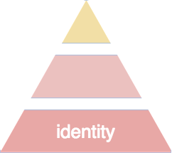

# Achieving Digital Happiness: Your Identity Needs

things are changing for internet companies such as **Facebook, Amazon, Google, Twitter,** and **Microsoft**  
· new consumer·protection laws such as Europe’s **General Data Protection Regulation** (GDPR) and the **California Consumer Privacy Act** (CCPA) give people the legal tools to find out what personal·information internet companies collect, how they use it, and whether they share or sell it to other entities  
· the laws also allow people to stop companies from using or sharing their personal·information  

however, while after·the·fact measures are sometimes helpful, most of the time they are not  
· once somebody obtains your social·security·number and home·address, there is little you can do to address the fact that people can now impersonate you, get credit cards, and buy things in your name for their own use  
· powerful companies lobby lawmakers to weaken laws aimed at giving consumers effective tools to control how their personal·information is used  
· CCPA is an example of such weakening  
· instead of allowing people to sue companies that do not adhere to the consumer·privacy regulations—as it was proposed in the ballot initiative that hastened its creation—CCPA allows consumers to sue irresponsible companies *only* if they can prove that actual harm occurred in response to companies’ negligence  

one effective way to keep personal·information secure is for people to place and keep their data in their own **secure·data·vaults** or **personal·clouds,** ubiquitous and secure stores of personal·information  
· these secure·vaults would be accessed only by the entities the data·owners authorize  
· only entities with whom the owner has made connections and explicitly authorized to read or modify eir protected·data would be able to do so  

i will talk more about these secure·data·vaults in an upcoming article  
· for now, let us explore an essential prerequisite to having these secure·vaults: an effective, secure, and reliable *personal·identity·infrastructure*  
&nbsp;
&nbsp;
&nbsp;

## use a secure·device to attest your identity on the human·internet
the **human·internet** is the internet that offers people an effective *digital·identity*, real *data·privacy*, and concrete, enforceable *data·security*  
· the human·internet has effective infrastructure, rules, policies, and procedures focused on the needs of human·beings, not profit·dedicated entities who compromise their public positions when their profits are threatened  

we have seen how bad·actors take advantage of the openness of the internet to abuse their access to personal·information, create fake identities, impersonate others, or spread hate anonymously  
· these actions will not be possible on the human·internet  

effective, reliable, and easy **authentication** (proving to others that you are who you say you are and whom they think you are, and the other way around) is essential for people to view the human·internet as an environment they can use to store their data, make connections, conduct business, express themselves, and help others  

current technology provides the tools needed to perform easy, reliable authentication  
· many current digital·devices have a capability called **trusted·platform·module** (TPM) that is usually implemented in a **secure·chip** known as *secure·enclave* or *secure·element*  
· this is a chip whose contents are not directly accessible to apps or other software, not even a device’s operating·system  
· the chip manages **digital·keys,** which can be used to secure your personal·information on the phone and on the human·internet  
· there are two types of digital·keys, *private·keys* and *public·keys*, which come in pairs:  

  * a **private·key** is used to encrypt and sign data, and is known only to the secure·chip  
  * a **public·key** is built from a private·key, and can be used by any entity who needs to verify another entity’s identity  

the secure·chip can encrypt and decrypt information without revealing the private·keys used perform those tasks  
· the only way apps have to getting data from the chip is by interacting with it  
· think of it like a bank teller  
· the only way to get cash out of a bank is by providing the right information to a teller  
· in a similar way, apps that run on your device can request public·keys from the chip, but cannot obtain the private·keys on which the encryption process is based  
· without your private·keys, other entities cannot digitally impersonate you

you probably have in your hands a device that can serve as your *personal·id* on the human·internet   
· with the wide availability of phones with secure·chips and biometric capabilities (processing faces and fingerprints), they make good and convenient **personal·identification·devices,** personal·ids for the human·internet  
· using personal·identification·devices, all entities can trust that when dealing with other entities on the human·internet, they are dealing with the person or organization they expect to be dealing with  
· in the human·internet, no entity can impersonate you  
· thanks to the secure·chip, a hacked device or app can do to little damage to your personal·information, your safety, and your reputation  

with your secure device on hand, you can have your trusted digital·identity implanted in it so that you can be a citizen of the safe and secure human·internet  
&nbsp;
&nbsp;
&nbsp;

## base your digital identity on your *real·life* identity
in real life, you must often **authenticate** yourself to others, such as when you show your ID to enter a concert or buy booze  
· the same it true in digital·life  
· you often use a username and a password to authenticate to an app or website that you are a registered·user   

entities use several open standards that aim to provide authentication capabilities to entities on the internet    
· these standards include:  
  * **Cryptographic Token Interface (PKS #11),** used throughout the internet to manage digital·certificates and to work with smart cards to provide *single·sign·on* capabilities  
  * **FIDO,** used by **YubiKey** to authenticate users to desktop or laptop devices  
  * **OpenPGP,** used in several platforms to perform encryption, message·signing, and authentication tasks  

all those standards accomplish what they set out to accomplish through reliable processes and chains of trust  
· however, to provide *trusted·authentication* for entities on the human·internet, something else is required: a person that can vouch·for or *attest to* the identity of another person  

the first step to establish your identity on the human·internet is to verify your identity in real·life  
· because government agencies are the best legally·recognized authorities who can attest to someone’s identity, for access to the human·internet, people use notaries·public to create their trusted digital·identities  
· notaries·public perform this service by relying on documents people provide that prove their identity  

to make a secure·device your personal·identification·device you take your identity·proving documents and your device to a notary·public  
· after verifying your identity using those documents, the notary·public runs a special app on your device, which instructs the device to authenticate you as its owner—which you do with your face or fingerprint, and PIN  
· the notary·public then enters your main identifiers (fullname, nickname, birthdate, birthplace, and a picture of your face) and the notary·public’s attestation·credentials (which include a picture and an identifier issued by the appropriate city of jurisdiction) into the app  
· after connecting to a personal·identity·service, your device becomes your personal·identification·device on the human·internet  

now, you can use your phone to make connection·requests to other individuals, who may accept, deny, or ignore your request  
· you may also receive connection·requests, which you can also accept, deny, or ignore  
· all entities on the human·internet can rely on the fact that the real identities of all entities participating in connection·requests have been attested by a government authority  
&nbsp;
&nbsp;
&nbsp;

## know who you deal with, for your safety
on the human·internet every entity represents a real·life entity  
· there is no anonymity  
· there are no fake entities  
· when you connect with someone through your personal·identification·device on the human·internet it is just like making a connection with someone in real·life

