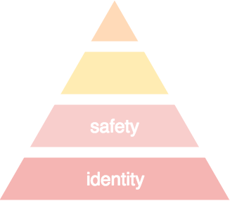

# Achieving Digital Happiness: Your Safety Needs
  

after having met your [identity needs](https://ernestbruce.tumblr.com/post/180655055000/achieving-digital-happiness-your-identity-needs), your safety needs are next up in the [hierarchy of digital needs](https://www.youtube.com/watch?time_continue=19&v=yM8SwZkvCIY)  
· but what does *digital·safety* entail?  
&nbsp;

your data is safe when:  

  * it is *ubiquitous* (it is widely distributed so that it is readily accessible everywhere) and *resilient* (it survives despite the unavailability of several storage devices, as long as one device storing it is available)  
  * it is *private* (encrypted) and *secure* (its access is strictly controlled by you)  
&nbsp;

so what do data ubiquitousness, resiliency, privacy, and security on the internet look like?  
&nbsp;
&nbsp;
&nbsp;

## data ubiquity and resiliency
there are many internet protocols that can be used to implement a solution that provides the capabilities that would make your data safe  
· the best and most future·proof of those is *IPFS*  
&nbsp;

[**InterPlanetary·File·System** (IPFS)](https://ipfs.io) is a protocol through which linked computing devices implement a resilient network for the secure·storage and secure·transmission of data and content  
· IPFS is distributed and trustless, which means that it does not require centralized hosting and administration to operate  
· it is also highly efficient in its use of bandwidth and impervious to the focused attacks that centralized systems suffer from, such as [**distributed·denial·of·service·attacks** (DDoS)](https://www.digitalattackmap.com/understanding-ddos)  
· it is the future of the internet or, rather, the foundation of a new decentralized internet  
&nbsp;

IPFS can operate on a wide variety of devices and operating·systems, making it easy to implement using existing infrastructure  
· it is also highly scalable, able operate from a single device to billions of them, while remaining efficient  
&nbsp;

*IPFS provides ubiquitous and resilient storage of data*  
· it also provides the basis on which several other capabilities can be built, such as [transliterature](http://transliterature.org/), content·exploration and discovery, personal·communications, and content·streaming  
&nbsp;

IPFS does not, however, provide for the privacy and security of the data it handles  
· those capabilities have to be implemented on top of this distributed, resilient network  
&nbsp;
&nbsp;
&nbsp;

## data privacy and security
after guaranteeing data ubiquitousness and resiliency, we need to ensure its privacy and security    
· this requires the use of an *identity and authentication protocol* such as [**OpenID·Connect**](https://openid.net/connect)  
· the main participants in such a protocol are you (the end·user), the party wanting access to your data (the relying·party or data·consumer), and the *identity·provider*  
&nbsp;

in this model, initial interactions between data·consumers and you data are mediated by the **identity·provider**, which forwards *requests·for·connections* (usually for authorization to access your data) to you, which you respond to on one of your personal·identification·devices  
· because OpenID·Connect is an internet standard, using it as the model for implementing the privacy and security of your personal·information would make it easy for third·parties to gain access the data and content in your *personal·cloud*  
&nbsp;

your **personal·cloud** is a store of your personal data and content in a publicly·accessible, private and secure storage and compute solution  
· this personal·cloud is similar to Apple’s **iCoud** and Google’s **Google Drive** services, but with people’s benefit as its North Star  
· entities (data·consumers) who require access to the data and content you store in your personal·cloud, would pay  for the ability access it (from their point·of·view, they would get access to data that is more valuable than what they can get using shady practices)  
· however, they will also be required to make a direct connection with you, which would happen thru one of your personal·identification·devices  
&nbsp;
&nbsp;
&nbsp;

## safety attained
by ensuring the privacy and security of your data, and providing you pervasive and resilient storage for it, the human·internet, powered by your personal·cloud, fulfills your safety needs:  

  * you can store you data and content in a publicly·available personal·cloud that guarantees that you and the parties you authorize always have access to that data and content  
  * you have *confidence* in the privacy and security of your data, managed using infrastructure, policies, and rules made to keep your data hidden from entities who are not authorized to access it, and to ensuring that your data is always correct and never lost  

