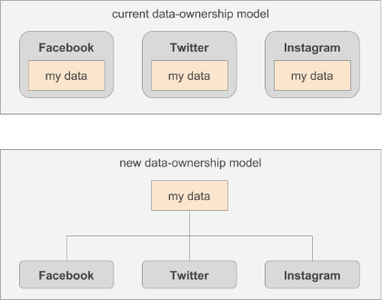

# Disrupting the Disruptors Because, Humanity
## beyond regulation, forever changing everybody’s relationship with data

&nbsp;

instead of *legislating* our way out of our data·privacy and data·security problems, we must *engineer* our way out of those problems, producing a more effective, permanent, and humane solutions  
· the legislative approach is a good one, and it should be pursued  
· but the engineering approach is better because it is actionable, testable, and can improve over time  

a people-centric and people-driven ecosystem where human and nonhuman entities can operate privately, securely, and safely is the best alternative to the dominance and criminality of internet behemoths like Facebook  
· the **human·internet** is the network that gives you total control over your personal·data and the personal·information entities create from your data and your online and offline activities  
· the ecosystem comprises many open and public computing platforms that provide alternatives to Amazon, Apple, Facebook, Google, Microsoft, Twitter, Uber, and many powerful yet unaccountable internet entities that give profit and dominance higher priority than human·rights, fairness, and justice, which is their legal mandate  

the human·internet protects personal·data from abandonment by entities focused on growth, exits, and pivots  
· by offering a common data·language, many data·processors can speak the same language when it comes to accessing and manipulating a personal data and information  
· through federated distributed·computing models, people have many options for storing their personal·data, which will no longer be hosted by the entities who trade on that data and amass it to become the go-to places for advertisers to present their content to people of their choosing  
· companies like Facebook use deceptive and illegal practices to obtain as much personal·data as possible to allow the surgical targeting of ads to people who use their “free” platforms to perform their human activities  

ecommerce companies like Amazon use their dominance to target and neutralize smaller businesses  
· by providing a platform for ecommerce and also being a participant in the platform, Amazon bullies its way to positions of dominance in any successful business area, while making it hard or impossible for the originators of those successful products to reap the benefits of their innovations  
· open ecommerce platforms that compete with Amazon’s platforms is how humanity neutralizes Amazon, regardless of any other legal approaches governments take to curb Amazons cancerous influence in our digital lives  

instead of promoting the creation of unicorns, the human·internet supports the founding and nourishment of specialized businesses, who focus their expertise and resources on one or a few aspects of an industry  
· these entities do not pursue sky high revenue and billions of human users  
· instead they provide the components that people use to create their custom digital·life, something that the internet behemoths—with their gaze glued to their bottom lines—are unwilling and incapable of doing  

the remainder of this document discusses the values, principles, and policies of the human·internet, how they provide a humane, secure, and safe alternative to the behemoths, and how businesses benefit from participating on an open, egalitarian, and humanistic ecosystem, where *people* and humanity are its principal beneficiaries  

&nbsp;

>to ensure our continued existence, humanity must dedicate itself to [populating other parts of the solar system](https://www.livescience.com/62109-hawking-last-tv-appearance-leaving-earth.html "LiveScience: In a Final TV Appearance, Stephen Hawking Imagines Humanity Colonizing Alien Worlds") in the next 100 years and [other star systems][Living_Universe] within the next 1000 years  
· this makes *technological advancement* our highest priority  
· this makes *profit* for profit’s sake irrelevant  
· this makes *war* a thing of the past  
· this makes *care for our environment,* *efficient use of resources,* and *the advancement of humanity* our only worthy goals  
· dedicating ourselves to these goals will give each of us [fulfilling occupations](https://youtu.be/tRHsq40f0pE "YouTube: The Drone Engineer Helping Farmers Work Smarter") and [new sources of food](https://youtu.be/of-fBY2Zj3Y "YouTube: Food Computers Are Here And They’re About To Revolutionize Agriculture"), and will ensure a bright and safe future for our descendants   
· working together on those goals will help us to cherish and respect one another for the contributions each of us makes to humanity’s progress  

&nbsp;

the internet·community includes cisgender and transgender people, scientists, politicians, strangers, friends, and criminals  
· the technological foundation that allows this community to exist is the [internet protocol suite][internet·protocol·suite] which, while facilitating reliable and resilient communication, does not ensure verifiable identity, reliable privacy, and strong security in our increasingly digitized lives  
· ***this is why people cannot trust the internet***  

many of the companies who operate on the internet, such as Facebook and Google, who publicly promise to be agents of good, have behaved dishonorably at best and criminally at worst  
· ***this is why people cannot trust the companies who operate on the internet***  

Amazon, Apple, Facebook, and Google are good examples of entities who have improved lives and disrupted businesses and industries, but they have also behaved irresponsibly   
· they have gained power and influence, and reaped huge profits as a result of their innovations  
· however, most of these companies have not behaved humanely, and have [used their power irresponsibly or criminally][free_humanity]  
· also, in many cases and at [many levels][when_google_comes_to_town] these companies treat their customers as testers of their products and initiatives, putting customer data at risk and costing their customers significantly in wasted investment and unrealized value   
· some of these companies, like Facebook, have [behaved criminally](https://www.nytimes.com/2019/03/13/technology/facebook-data-deals-investigation.html "The New York Times: Facebook’s Data Deals Are Under Criminal Investigation")  
· and, even after many perfunctory apologies, they continue to misbehave  
· that may be the reason behind young people’s [growing disdain](https://www.marketplace.org/2019/03/06/tech/exclusive-look-numbers-showing-users-leaving-facebook-by-the-millions "Marketplace: U.S. users are leaving Facebook by the millions, Edison Research says") for the Facebook brand     

---  
humanity needs a better foundation, a better internet, one that guarantees verifiable identity, reliable privacy, and strong security, so that the companies who operate on it but still fail to protect people’s identity and data—due to negligence, incompetence, or criminality—can be admonished or punished appropriately  
· new, powerful and influential entities are being formed all the time, including [travel and lodging specialists](https://qz.com/1567574/airbnb-is-buying-hoteltonight "Quartz: Airbnb is buying into the hotel industry by acquiring HotelTonight"), [entertainment powerhouses](https://www.nytimes.com/2019/03/20/business/media/walt-disney-21st-century-fox-deal.html "The New York Times: Disney Moves From Behemoth to Colossus With Closing of Fox Deal"), and [media conglomerates](https://www.businessinsider.com/att-time-warner-acquisition-what-it-will-own-2018-6 "Business Insider: Here's everything AT&T will own after it buys Time Warner")  
· in addition to the assets, expertise, and reach entities acquire to improve their business prospects, they obtain control over the personal·data of large numbers of individuals, and the business·data of business·entities who rely on them to carry-out their missions  

**[Airbnb,][Airbnb]** with its purchase of **[HotelTonight,][HotelTonight]** may gain access to the locations and travel plans of HotelTonight’s human customers, which would help Airbnb, but may be detrimental to the privacy and security of HotelTonight’s customers  
· control over more personal·information may help Airbnb grow its business and make it more attractive to investors  
· however, while HotelTonight appears to [respect](https://build.hoteltonight.com/handle-with-care-using-data-responsibly-9a0e6bcc5710) their human·customer’s data, Airbnb’s track record in that respect is [not great](https://www.theverge.com/2017/4/14/15308736/airbnb-multi-device-authentication-security-hackers "The Verge: Airbnb adds new security measures to prevent"), which makes the new entity’s effectiveness at keeping personal·information secure an unknown quantity  
· therefore, after the merger, the security of the personal·data under HotelTonight’s control may be diminished in the newly·formed entity  
· this situation does not instill confidence in the security of the expanded collection of personal·data under the control of the new entity  

HotelTonight’s human·customers were not consulted about the new entity’s use of their personal·information, which includes payment·information  
· but it did not need to so because those customers agreed that HotelTonight could share their information with potential buyers and investors on its [privacy policy:](https://www.hoteltonight.com/terms-of-use/privacy-policy "HotelTonight Privacy Policy")

> With whom do we share your personal information?
> ...
> Potential buyers or investors - In the unlikely event that we wished to sell our business, we may need to share your personal information with a potential buyer or an investor.  

&nbsp;

in addition to a strong foundation, to satisfy the needs of its diverse population, the internet needs a similar diversity of business·models and user·experiences, closely tailored to the culture, tastes, and sensibilities of the people who are the source of most of the value the internet provides    
· just a few corporations dominating every aspect of your digital·life is neither fair nor sustainable  
· it has been proven many times and in many areas that diversity creates environments where fresh ideas are explored and nurtured, where different points of view and cultures are part of acclaimed products and services  
· a monolithic company whose success is based only on network effects is incapable of satisfying the needs of 
all its users  
· what it does very well is attract users through its size and influence but not its features, some of which may not be what people need or want but are pushed onto people to fulfill the company’s business goals    
· such a company is not motivated to make its product better than the competition  
· its focus is on *eliminating competition* (using tactics such as acquisitions and mergers) or seeking user growth by applying its business·model to different markets  
· this makes sense, from a business·growth perspective   
· but, from a humanistic perspective, a person staying in a service only because eir friends, family, and acquaintances are also in the service—even as the service exhibits fundamental problems—says very little about the quality of the service itself  
· people stay in it because they do not have a real alternative for staying connected to their family, friends, and acquaintances   
· people need alternatives that are compatible with their sensibilities and tastes, and thru which they can interact effectively with the *only* family, friends, and acquaintances they have  
&nbsp;

> the time when innovative, transcendent products and services die because of competition from entrenched internet behemoths using unfair tactics and their control over personal·information ***is over***    

&nbsp;  

personal·information is a valuable resource that must be respected and protected, not treated like an expendable commodity (a lure) to target people with ads or to manipulate their thoughts and opinions at a large scale  
· companies collect vast amounts of personal·data from you, your devices, the businesses you visit, and from entities dedicated to the trafficking of personal·information such as **[eXelate][eXelate]** and **[BlueKai][BlueKai]** (now part of **[Oracle][Oracle]**)  
· instead of using that information to help you or humanity, those companies use it to target you with ads, to sell you stuff, to feed their artificial·intelligence models, to shape your thinking, to make you act against other individuals based on their gender, race, culture, ancestry, or way of thinking  

with their actions, these companies have earned their own disruption  
· *you* must wrestle from them the resource that makes them so powerful  
· that resource is *your data,* and you have the right and the responsibility to take it from them, to ensure a better future for humanity  

it has become fashionable for companies like Facebook to [call for regulation][Facebook_calls_for_regulation]  
· that is because, thru lobbying and other practices, they aim to get *friendly* regulation, like the [California Consumer Privacy Act,][California_Consumer_Privacy_Act] which was made substantially weaker from its original vision by companies like Facebook, Microsoft, and Google  
· while regulation and even breaking up big corporations like Facebook and Amazon may be beneficial to humanity, a better approach is to fundamentally change the relationship between companies and their customers’ data (both personal·data and business·data) into one in which they are *agents* who are given access to data 
by the **data·owner**  
· the owner can revoke such access at any time, with the same ease with which a person can change the visibility of a Facebook post, or block a particular users  

the **People Own Data** (POD) approach to managing personal·data represents the rights of individuals and business·entities to control and manage data about themselves and any data that can be used to identify them  
· legally, individuals *own* such data (regardless of how it was captured or produced) and are free to allow access to their data to other entities and to dictate to those entities how that data is to be used and disposed of  
· these entities are *not* allowed to share **owned·data** with other entities, including parent companies, sibling entities, and business partners  
· entities who want or need to use any owned·data, must obtain authorization from the data·owner  

---
what the internet needs is *federated centralization of personal·data*  
· this means that personal·data is centrally controlled and managed by its owner (you, your business) but the means thru which it is stored, retrieved, processed, and disposed of is federated among a set of entities 
chosen by the owner  
· among these entities is **Peoples**, a platform that aims at giving Facebook, Google, Apple, Amazon, and other internet behemoths real competition through open·source, open·standards, transparency, honor, responsibility, and accountability, things that do not exist in the internet (and in business in general) today  
· there is not a single entity operating on the internet today that can claim to rightly posses and exhibit all those attributes  
· **Peoples·Foundation** is the nonprofit organization whose main goal is to fund Peoples’ operations and promote the development and operation of the *next-generation internet*  

there are other projects, similar to Peoples, that strive to bring us personal·data centralization  
· one of them is **[MesInfos][MesInfos]** (MyData)  
· other companies, platforms, and organizations with the capability of giving the behemoths real competition are **[System76,][System76]** **[UBPorts,][UBPorts]** and **[RISC-V Foundation][risc·v·foundation]**  
· however, they operate separately, without single overarching vision informing their activities  
· the behemoths have the luxury of exercising their power under a single vision  
· to marshal the considerable resources and to inspire the experienced engineers, scientists, technologists, anthropologists, psychologists, doctors, and advocates needed to give humanity a real alternative to the behemoths, these up and coming platforms must operate under a strong common vision, policies, and rules, to ensure that the next evolution of humanity’s digital life is geared for, accountable to, and in the best interest of *people*  

no one company shall have exclusive control over the data·models and algorithms used to manipulate personal·data  
· the models and essential methods for processing personal·data shall be open and usable by any **data·manager** (an entity who controls personal·data)  
· in fact, this is how the next-generation internet ensures the security and safety of personal·information  
· data·loss and data·corruption problems will be drastically reduced or eliminated by exposing the formats of the data and the methods that manipulate it to the public  
· anybody, everybody is able to view the specifications and analyze the source·code that implements them to ensure that they are work correctly (do not damage data), operate securely (protect data from unauthorized access), and ensure the safety of the data they manipulate  

organizations like Peoples will use the open·source software that defines the next-generation internet to manipulate all personal·information  
· this means that any company can manage your personal·data  
· you can change social·services (like Facebook, Mastodon, and others) as easily as you change clothes: while the clothes are different, it is the same you underneath  
· you will not need to *transfer* any data from one service to another  
· all you have to do is deauthorize one service and authorize the other to access your one set of personal·data  

---
this document introduces the solution to the internet’s identity, privacy, and security problems, and problems with the credibility of content on the internet    
· the solution is the **human·internet,** and it will give you, your friends, your family, and humanity the power of your data, a superpower that has been stolen, sold, shared, and abused without your permission or consultation (for the most part) by entities dedicated not to *your* well being, your privacy, or your self·improvement, but to *their* own enrichment, at *any cost*  
&nbsp;

sections:  

  * [WHAT IS THE HUMAN·INTERNET](#what-is-the-humaninternet)
  * [CUSTOMERS AND BAIT](#customers-and-bait)
  * [EYES FORWARD](#eyes-forward)
  * [VISION, PRINCIPLES, VALUES](#vision-principles-values)
  * [IDENTITY, ENCRYPTION](#identity-encryption)
  * [POWER TO YOU](#power-to-you)
  * [POWER TO THE PEOPLE](#power-to-the-people)
  * [DIGITAL ECOSYSTEM](#digital-ecosystem)
  * [LET’S BUILD IT](#lets-build-it)

&nbsp;  
&nbsp;  
&nbsp;  

## WHAT IS THE HUMAN·INTERNET
the human·internet is the internet based on human values and principles  
· it is the internet we should have created in the first place  
· with time and by the misdeeds of powerful entities, we have learned that need to impose rules that specify what entities can and cannot do with personal·information  
· without rules, companies like Facebook, Google, and many others feel free to do whatever they want with personal·information as long as they make money from those actions  
· through their actions (and sometimes through public announcements), companies are asking to be regulated  
· the human·internet is the answer to their requests  

&nbsp;  
&nbsp;  
&nbsp;  

## CUSTOMERS AND BAIT
> you are *not* the customer  
> you are the **bait**  

&nbsp;

internet·companies can do a lot with personal·data  
· current technology allows them to find out a lot about us  
· unfortunately for us, we are not their customer  
· they use information about us to provide services or advise to their real customers, such as advertisers, insurance companies, and banks  

internet·companies can do many “innovative” things with personal·data because they 
practice *irresponsible·disruption*  
· they make products and services available for purchase that are little more than experiments  
· they “move fast and break things”  
· they are beholden only to their mantra of generating growth and maximizing value for their shareholders  
· they use data about us in any way they want, not only because of the lack of laws and rules but also because we are being desensitized to the value of our data  

we share freely our social, health, location, financial and other kinds of intimate information, which we used to keep secret  
· internet·companies have developed innocent-looking and practical mechanisms to push us to share things like our tastes (likes), our whereabouts (check-ins), and our political leanings (groups)  
· by collating such information about hundreds, thousands, and millions of us, a few powerful companies have the resources needed to manipulate large swaths of people, *to change our minds*  
· our data is the key to our souls, and the holders of those keys are no [angels](https://youtu.be/C2Ag1iQKWeM "Data spies: The dark and shady practices of Silicon Valley | Roger McNamee")  
· our data is not being used with our best interest in mind   

---
advertisers spend a lot of resources getting their ads to be viewed by a specific audience, but they are not spending enough on the ad-consumption experience    
· ads are content that we do not want to see and mostly ignore (except, for some of us, on the first Sunday in February)  
· this means that, systemically, resources are being used inefficiently  

  
&nbsp;

content that is more tailored to you and your sensitivities would be more effective in helping advertisers to establish real connections with you that are mutually beneficial  
· content companies should not treat you as bait for advertisers  
· they should consider you another customer, who has needs for connection similar to the needs of the advertisers they serve  

the human·internet uses *entity·introductions* instead of ads  
· **entity·introductions** are very similar to introductions made by matchmakers  
· the matchmaker knows information about two parties that help sie determine whether they should connect  
· the two other parties may not know each other, but they trust the matchmaker implicitly because of their past experiences with sie or eir reputation and knowledge   

in the human·internet, instead of advertisers targeting the members of a network either blindly or using certain criteria, they share information with a content·provider, which could provide information services 
to content·consumers  
· the advertiser can request an introduction to a particular person or anyone matching some criteria  
· the content·provider then may present the introduction to the person, identifying to sie the information used to make the match  
· if the content·provider presents the invitation to the person (or a set of people), sie is then free to act on it as sie sees fit, depending on the options the invitation provides   
· the content·provider, however, may decide that the introduction is not appropriate for any reason, and may, or may not, notify the advertiser of its decision  

the advertisers who request entity·introductions to specific persons must prove that the information they provide that identifies the individual (name, picture, birthplace, and so on) was obtained from an entity authorized by the person to have that information  
· the content·provider is responsible for ensuring that the advertiser obtained the personal·information used to request the entity·introduction from an authorized·entity  
· if content·providers make many inappropriate or annoying introductions to a particular person, the person may not let the content provider present sie entity·invitations, or sie may stop using that particular content·provider and switch to another that provides a better experience and shows more respect for it content·consumers  
· this will contribute to a better “ad” experience for people, and better relations with customers for advertisers, based on respect for the individual    

&nbsp;  
&nbsp;  
&nbsp;  

## EYES FORWARD
---
> to move humanity forward, *people* must reshape the business·model of the [personal·information oligarchs][personal·information_oligarchs], who mine, package, and process your life for profit, while putting your identity, privacy, and security at risk  

---
&nbsp;  

the future *is not* intelligent computing available only to big corporations  
· the future *is* people having the power of today’s desktop workstations on their wrists, today’s [high·performance·computing][high·performance·computing] available in their hands, and [exascale·computing][exascale·computing] power available on their laps and desks  

the future *is not* your information spread over data·silos everywhere, controlled by profit-blinded, unscrupulous, and criminal organizations  
· the future *is* a **datapod** (a managed collection of data and content controlled by you, the data·owner) with your data, accessed by trusted, responsible, and principled entities, who process your information on *your* behalf  

the future *is not* one monumentally flawed interpretation of [social·computing][social·computing]  
· the future *is* many interpretations of social·computing that are culturally sensitive, catered towards entertainers, politicians, intellectuals, teenagers, seniors, rocket·scientists, astronomers, biologists, swimmers, sky·divers, race·car·drivers, bicyclists, runners, dentists, surgeons, teachers, tailors, architects, runway·models, firefighters, police·officers, and lawyers, each with their own practices, norms, acceptable content, and so forth, which are *not* specified by companies with their eyes glued to the bottom lines of their balance sheets  

the future *is* the *dataweb,* featuring direct connections between data·items  
· **digital·entities** (also known as [**digital·organisms**][digital·organisms]) will be able to navigate data like you can navigate the web  
· these organisms, in addition to having implicit knowledge and experience, will be able to access any piece of connected data  
· and, because personal·data will no longer live in silos, all that data will be accessible at once  
· this will make digital·organisms capable of unimaginable things  

and this amazing power will be owned and controlled by *people*  
· this technology will be open to everyone  
· it *will not* be controlled by entities bent on making profits at any cost  
· in the future, when it comes to personal·information, people will have the first and last word because on Mars, on Europa, and on Proxima b there is no Facebook (Facebook is not an instrument of human·exploration, of human·advancement, it is an instrument of profit, for few)  
· people will take their data and their own internet with them when populating other planets and moons, and when traveling our galaxy, no Facebook needed or wanted  

the internet has gotten the way it is—dominated by entities who use personal·information to make money, and the home of criminals who steal information from its rightful owners—because it was developed without human 
values or principles  
· its creators could not have imagined the wonderful innovation it would facilitate  
· they also could not have imagined the abuse, disrespect, and contempt for digital·life that its major users would bring to humanity  

*we* must take the initiative in the digitization of our lives  
· companies, *all of them,* have demonstrated that their motives are always skewed toward profit, 
if not pure greed  
· while making a profit is good in general, something is lost when every aspect of humanity is viewed through the lens of profitability  
· [Boeing][Boeing] had this view when it decided to offer for sale a [flawed, unsafe plane,][Boeings_plane] to try to compete against better-designed planes by [Airbus][Airbus], and put in peril the lives of the millions of people who fly every day  
· [Eli Lilly][Eli_Lilly] and other drug manufacturers make [large profits][insulin_prices] out of the lives of people with diabetes because they can; people generally pay anything to stay alive  
· and Facebook uses the data we willingly (and unwillingly) provide about ourselves to generate large amounts of revenue and profits without regard to the risks to our privacy and safety, despite any public pronunciations of its executive officers, as former employees and internal communications demonstrate  

no, we, *the people,* must take charge of our own digital·life  
· the behemoths can join us under our terms or stay behind  

&nbsp;  
&nbsp;  
&nbsp;  

## VISION, PRINCIPLES, VALUES
the internet lacks values  
· other than effectiveness and efficiency as a communication infrastructure, the internet has no human values  
· there are some [organizations](http://www.connected.org/is/values.html) who try to implant values on it  
· but, at its core, the [internet][internet_plan-internet] is a valueless, amoral network of computing devices exchanging information as efficiently as possible  

without a vision and values geared towards humans, the internet infrastructure is incapable of 
reflecting humane traits  
· nothing in its specifications and implementation say anything about guaranteeing the privacy, security, and safety of its human participants  
· because of that, it is easy for many entities on the internet to dedicate themselves to separate people from their money or to capture data about them and use it to obtain revenue, not to improve the human condition  
· *this is unsustainable, self-destructive behavior*  
· people eventually revolt against entities that operate against their best interests    
· just as with the [financial sector][industry_regulation] years ago, people will not take this anymore and will rebel against the companies that abuse them  

the internet of tomorrow, the human·internet, has a vision, principles, *and* values that guide its participants in their journey to help people be better people, and to move humanity forward  

&nbsp;  
&nbsp;  

### Vision
the human·internet vision guides every aspect of its operation:  

  * **bring technological advancement** to individuals, societies, and humanity  
  * **educate** entities in the humane treatment of individuals and their personal·information  

&nbsp;  
&nbsp;  

### Principles
the human·internet principles guide the development of human-centric technologies, policies, and rules used in the ecosystem:

  * entity·data belongs to the owner, who maintains total control over it  
  * entity·data must remain *private*   
  * entity·data must be *encrypted* at all times, except when needed during *local* processing  
  * entity·data, even in its encrypted form, must be *protected* from unauthorized access  

&nbsp;  
&nbsp;  

### Values
the human·internet values describe the behaviors expected of all participants in the ecosystem  
· violations to these values are grounds for suspension or expulsion from the ecosystem  
· you can remember these values using the acronym RISE:  

  * **respect**  
  · we respect the privacy and sovereignty of every participant  
  * **integrity**  
  · we are honest, open, and transparent in all our activities  
  * **service**  
  · we provide first-class service to people and to those who help them  
  * **excellence**  
  · we strive for and seek excellence in everything we do  

&nbsp;  
&nbsp;  
&nbsp;  

## IDENTITY, ENCRYPTION
the current internet infrastructure does not provide the protections required to guarantee the privacy and security of personal·data  
· a new infrastructure is needed, based on *real·identity* and strong encryption  

there are a number of [initiatives](http://identity.foundation "Decentralized Identity Foundation") and [projects](https://www.theverge.com/2019/3/4/18249895/web-authentication-webauthn-world-wide-web-consortium-w3c-standard-browsers "The Verge: The web just took a big step toward a password-free future") that aim at providing strong identity on the internet  
· but they are *worthless* if they do not have as their foundation a link to a person’s *real* identity (using credentials such as passports or other government-issued identification which include identifiers such as photo, name, and birthdate) and are unable to guarantee that someone cannot assume a fake identity (or an identity that does not belong to that person) using contrived or stolen credentials  
· *privacy* is not the same as *anonymity*  
· in the human·internet, the former is desired, the latter is not  

you must be able to trust that every entity you deal with in the digital·world is real  
· the infrastructure on which entities operate must guarantee that they (individuals and organizations) are legal entities whose identities have been attested by trusted and accredited human·beings, such as notaries·public  
· this attestation must be done every five years  
· no entity can be anonymous or use false identifying information to connect with other entities or publish content  
· you must be able to easily and *immediately* verify the source of any content you see to determine its authenticity  

a second necessary aspect of protecting a person’s privacy is encryption  
· personal·information must be strongly digitally locked so that entities who somehow get access to that information are not able to read it  
· only entities with authorization from the owner of a particular set of data should have the key with which that data can be decrypted  
· entities with control over encrypted personal·data must perform decryption operations in specialized devices that are strongly protected from access by all entities  
· these devices are called secure elements  

&nbsp;  
&nbsp;  
&nbsp;  

## POWER TO YOU
---
>the human·internet has human values  
· it serves you, and helps businesses serve you privately, securely, respectfully, and honorably  
---
&nbsp;

the closer you are to your data, the more use you get our of it  
· your data should be at your fingertips, without the need for a phone call or email requesting it from those with control over what is rightfully yours  
· reviewing your latest medical test with your doctor’s notes while comfortably sitting on your couch is your right  
· being able to do that on your 4K television would be nothing short of amazing  
· this is possible with your data at your fingertips  

your personal·information is more important than any corporation’s business·model  
· you let companies access your data so that they can serve you   
· if you do not like how a company does business or do not like its service, you do not need to [*move*][data·transfer·project] your data to another company  
· you just need to give another company permission to access *your* data, the same data the other company lost its permission to access by failing you, or by not meeting your needs  

when you stop liking an airline, you fly with another one  
· there will not be another copy of you continuing to fly that undesirable airline  

*in the human·internet, your data is the center of the universe, all things and entities revolve around it*  

&nbsp;  
&nbsp;  

### Eliminating data·silos

&nbsp;

internet·companies control your personal·information to make you use their products because those products may be inferior to similar products from other providers (remember, your benefit is a miniscule component of their growth strategy)  
· their goal is to collect as many users as possible, not to actually be helpful to them  
· this is because, for the most part, people are not their ultimate customers  
· their real customers are the entities who pay them to [target people with ads](https://youtu.be/n2H8wx1aBiQ "YouTube: Senator, we run ads")  
· but when it comes to essential services, or ones that help people manage personal·information such as social·services, healthcare·services (healthcare·providers), and health·insurance·services (health·plans), people need the flexibility that a multitude of products and services competing on merit—not on personal·information gathering practices—can provide  

these companies generally form **data·silos,** places that maintain collections of personal·data that provide them with business advantages  
· but for individuals and society, data·silos are both wasteful *and* ineffective  
· for example, healthcare providers would provide more effective service if they were able to access your entire body of health·information, not just the information they obtained directly from you or from other medical organizations that use compatible systems, or information they received through email, regular mail, or *faxes*  
· they would benefit from knowing that you actually took the medicine doctor prescribed at the appropriate times, and that you have been active the past week, by being able to see how many steps you took and your heart·rate  
· with comprehensive information in digital·form, doctors would make thoroughly informed and timely decisions, and the system as a whole would be more efficient, wasting fewer resources on the storage and maintenance of duplicate or redundant copies of health·information  

the data·silos healthcare·providers and health·plans rely on make for an ecosystem that forces you to ensure that the records each entity keeps on you are correct  
· this makes interacting with these entities tedious and mentally draining  
· why must you fill paper forms with your health·information when visiting a new medical facility?  
· and why must you fill the *same* forms with the *same* historical information, over and over?  

when entities use datapods to store and manage your health·data, efficiency increases, annoyance decreases, interactions between healthcare·providers and health·plans run smoother, and patients are happier *and* healthier thru fewer, more focused procedures  

---
credit reporting agencies duplicate data amongst themselves, and control data that is *yours*  
· these entities (members of the **Consumer Data Industry Association**) should store their research on your creditworthiness on your datapod  
· while such information would be modifiable only by them, you would be able to view and analyze it at no cost, anytime you like  
· with that information readily available (not only once a year), you would be able to make informed decisions related to your creditworthiness and would not have to seek reports from several agencies to ensure that all of them have the correct information  
· and when they fix their mistakes, you would be able to confirm it on the spot, in the place that serves as the authoritative store of that information  
· a single store of credit·data in your datapod would result in more efficient interactions regarding your credit·information  
· not to mention that these entities have proven incapable to protect the valuable information they control, with Equifax putting millions of people in [peril][Equifax·breach], for example  
· in addition to not protecting your information, companies like Equifax do their best not to disclose the extent of the damage their negligence or incompetence causes people, which shows how little respect they have for their product (you *are not* their customer; you and your data are the *product* they offer their real customers)  

&nbsp;  
&nbsp;  

### Owning your data
personal·data outlasts any [product](https://www.theverge.com/2019/3/1/18246794/microsoft-band-refunds-apps-services-end-of-support-may-fitness-tracker "The Verge: Microsoft to offer Band refunds, announces end of apps and services"), any company, and any business·model  
· as the owner of your data, you must be able to have any capable entity manage and process it on your
 behalf  
· for example, you should be able to use the health·data captured on your Apple Watch (steps, heart·rate, and so forth) on your Chrome OS laptop  
· it is *your* health·data not Apple’s health·data  

businesses come and go, your data is permanent and universal  
· a diabetic wants easy and immediate access to eir glucose levels from eir handheld, tablet, and desktop devices at all times  
· the comprehensive health·data you capture today, such as your step count and heart rate, may provide you and healthcare·professionals critical information while researching a health issue 20 years from now  
· that health·data must be as useful in 20 years as it is today, regardless of the hardware and software used to capture it  

to ensure that data remains useful to its owner as long as the owner is alive or a going·concern, we need lasting data·models that are not tied to a particular company  
· when companies introduce products that have to do with personal·information, they need to submit those plans for consideration and further development to the **Human·Internet·Consortium** (an organization composed of entities who participate in the human·internet)  
· there, those ideas are considered as part of a “whole person” and “whole society” data·infrastructure with the aim of ensuring that records produced using the resulting data·models and interaction·models are supported by the entire ecosystem, not just by the company who introduced the models  
· in other words, universal data usability is assured at a fundamental level during feature design, not as an afterthought  
· we have seen how often companies introduce products to the marketplace that they view as testing platforms (funded by individuals sold on sales pitches), and later they leave individuals and even other companies and governments in the lurch, with data that is largely useless, unless it is translated into a different format or structure  
· in the human·internet, companies are free to innovate, but they innovate responsibly, with the needs and rights of individuals and humanity as their guiding light  
· *the human·internet leaves no data behind*  

the beneficiaries of rich personal·datasets must include the subjects and owners of that data, not just the entities who collect or compute the data  
· the companies who collect your data have shown that they are incapable of respecting 
and protecting it  
· they also have a tendency to abuse their access to your data  
· no matter their size, they are often breached, share your data with entities you do not know, or use it in ways they have not disclosed to you  
· or if they have, they did it on the legally binding contract you entered with them when you clicked Agree before starting to use their product or service
· have you read *any* of those usage·agreements?  

in a people-centric digital·universe, *all* your data (all data about you) is stored in your datapod  
· your health·data, your purchase·data, your entertainment·data, all data that identifies you or that can be used to identify you is stored in your datapod  
· this means that every entity you deal with stores data they collect about you, in any way, in your datapod  
· to do that, they must have to have a relationship (a connection) with you, and you have to have given them authorization to write data to your datapod  
· which means that entities who cannot access your datapod must not collect data about you  
· this is the future of data ownership and control by people  

instead of you signing terms-of-use contracts where you grant use of your personal·data to a number of entities you do not know, the entities whom you authorize to access data in your datapod enter into terms-of-access contracts with you, promising to abide by *your* privacy settings, and not to share the data they get from the datapod with other entities  
· you entrust them with your data, and they *must* behave responsibly with it  
· that responsibility is not transferable  
· these entities are not allowed to share your data with any other entity, no business·partners, no subcontractors, no subsidiaries, and no parent companies (WhatsApp would be able to access your datapod, but not Facebook, for example)  
· therefore, if any third·party with which they share your personal·data is breached or otherwise loses control of your data, the entity you entrusted with your data is responsible and liable for the breach and data·loss  

your data stored in a datapod provides several benefits:

* all your data is always up to date and coherent; this is your personal·data’s *single point of truth*    
* the effort for all authorized parties to get up-to-date information and to keep it that way is minimized  
* you always have the current view of your data (you do not need to ask anyone for access or permission to access your own information)  
* you can view present and past versions of your data  

&nbsp;  
&nbsp;  

### Authorizing data·specialists to access your data
a **data·specialist** is an entity capable of interacting with datapods  
· there can be health·data·specialists, such as healthcare·providers, and health·plans; social·data·specialists, such as social·services; and financial·data·specialists, such as banks and investment·firms  
· these specialists are further divided into *data·consumers* and *data·managers*  
· **data·consumers** can only get data  
· **data·managers** can add, get, modify, and remove data  

a social·service that helps you make connections is an example of a social·data·manager  
· while a calendar·service is an example of an event·data·manager and a social·data·consumer  

a datapod keeps your data safe and protected against access and tampering from entities you do not know, but you need to authorize access to it to data·specialists you trust so that they can get or manage the type of personal·data in which they specialize and to which you grant them access   
· you do this using special software in a personal·device such as a handheld or a tablet  

only the entities a datapod’s owner authorizes can manipulate eir datapod data  
· not even the datapod·service·provider can access the data, unless authorized by the owner  
· data is always encrypted using the strongest encryption available  

&nbsp;  
&nbsp;  

### Sharing your data with trusted people
a strong identity·infrastructure provides people and organizations with significant capabilities  
· the flexible authentication and authorization features available in the human·internet allow you to grant trusted individuals (and even some organizations) direct·access to your data, in case you are incapacitated or need others to have such access, such as your spouse  

when you give another person or entity direct·access to your datapod, that person can access it with the same flexibility you have, through the data·specialists you have authorized to access your datapod   

&nbsp;  
&nbsp;  

### *you* are the *platform*
 the internet of today is full of companies that create *platforms*  
· Amazon is an ecommerce platform  
· Facebook is a social and communication platform  
· Twitter is a news and microblogging platform  
· people create and publish content through these platforms  
· but must that be the case?  
· will Facebook be on the spaceships that take us to other solar systems?  
· no, only the people on the ships and their fellow travelers will be there  
· Facebook and its infrastructure will remain on Earth  
· in space *we don’t need Facebook*

what kind of platform are you?  
· all kinds  
· you are a social platform, a messaging platform, a research platform, a *whatever* platform  

you have family and friends, not *Facebook* family or *Facebook* friends  
· you have professional relationships, which encompass more than your LinkedIn connections   
· you can publish articles under your own name without the need for a Medium between you and your readers  
· what stops you from being your own platform?  
· nothing  
· in the human·internet, the principal, most powerful, and most influential platform is *you*  

the human·internet has no social·networks, it has *social·services*  
· the network is you  
· people follow you, they subscribe to your content, they get notified when you publish new articles dealing with sports, the automobile industry, or politics  
· Facebook, Twitter, Medium, and similar entities do not stand in between you and your audience  
· you are the content producer, moderator, and editor in chief  
· a social·service (a role that any entity can take) uses your network as the source of social·data about you  
· therefore, any social·service you use works off the same information, which gives you great flexibility regarding your social·experience  

whether you are an influencer or a newbie, you do not need a platform like Instagram or Twitter to get your message across  
· who other than you can determine what you have to say?  
· who other than you can specify what content you are exposed to?  

&nbsp;  
&nbsp;  

### Publishing and viewing whatever you want
in the human·internet, no one dictates what content you can publish and what content you can view on your devices  
· you are your own platform, and you have freedom of speech  
· you can publish any legal content you want  
· no one can tell you what to publish and what not to publish  

on the other hand, you can specify the type of content you want to view, and your desired sources for content  
· if you do not find a source credible (even after verifying its identity), you can add it to your undesirable·sources list, or remove it from your desirable·sources list  

you have total control over the content you publish and the content you view because this is the human·internet, *your* internet  
· however, you bear *total responsibility* for the content you publish  
· publishing unlawful and harmful content, such as shootings and murders, can put you the cross·hairs of law enforcement, whom may arrest, prosecute, and convict you  
· remember, you cannot hide under a false identity in the human·internet  

&nbsp;  
&nbsp;  

### Sharing different aspects of your life
you may have a personal life, a professional life, and a political life, which you manage using three social-networking platforms, such as Facebook, LinkedIn, and Twitter  
· some platforms let you crosspost to others, for example, a Facebook post can be duplicated in a Twitter tweet  
· because of the different capabilities and limitations of the platforms (for example, Twitter’s limit on the length of tweets) this is a broken way to bridge multiple aspects of your life  

in the human·internet *you* are your own platform; therefore, you do not need other platforms to define you or any aspect of your digital·life  
· you can use different *facets* of digital·life to compartmentalize your life both for your sake and for the benefit of those who are interested in your life, making it easier on you and your followers to produce and consume content  
· people can follow the “whole you” or only the “professional you”  
· although you have a single identity, it can be separated into facets that can be used across services  
· therefore, instead of “follow me at @*you*,” you can tell people interested in your political musings “follow me at *you*~politics”  
· and, when you need to publish a though or comment on more than facet, the same item is expressed on all the appropriate facets, giving its consumers the complete item without artificial limits placed on its expression  

&nbsp;  
&nbsp;  

### Founding groups and communities
you can found groups and communities that are platforms of their own  
· if you want to be part of a platform that is bigger than yourself, you can start groups or communities that exhibit traits you share with others  
· groups and communities can establish rules for membership and acceptable content   
· they may also develop capabilities that present specialized content or facilitate custom interactions 
between members  

these entities could be the foundation of mini social·services that may satisfy the belonging needs of most people, eliminating the need to join generalized social-networking platforms that are incapable of catering to particular audiences, and whose goals are not to help individuals, societies, or humanity, but to enrich themselves by collecting revenue from their real customers, advertisers  

&nbsp;  
&nbsp;  

### Universal privacy settings
in the human·internet, you set the parameters for access and disposition of your personal·data, which the entities you authorize to interact with your datapod must adhere to  
· you do this thru an easy-to-use interface on your personal·device, no emails or phone calls needed   
· the parameters specify, for example, how long a data·specialist can keep local copies of your data before they must be destroyed, or archived (for compliance with regulations)  

&nbsp;  
&nbsp;  

### Your personal·information dashboard
with your personal·data stored in a datapod, you can view and analyze all activity on your data at any point  
· this way, you know what entities modified your data and why  
· for example, you can monitor your financial·activity and see what medical·services your health·plan has paid for, and know when your last lab·tests are ready for your doctor to analyze  

&nbsp;  
&nbsp;  
&nbsp;  

## POWER TO THE PEOPLE
>as people learn how their personal·information is used by data·brokers and data·traffickers, they will increasingly reject the [surveillance·economy][surveillance·economy]  

our reality is increasingly digital, which means that those who control the technology that implements the core functionality of our digital·life have great power to influence individuals and societies and to impose their goals and objectives on humanity, even though humanity may not benefit from those goals and objectives  
· many of the physical items and activities we deal with in our daily lives are being transformed into digital alternatives:  
&nbsp;&nbsp; • paperless·banking  
&nbsp;&nbsp; • paperless·billing  
&nbsp;&nbsp; • digital·signatures  
&nbsp;&nbsp; • digital·currency      
· however, people have been slow to notice that the foundations of their lives are controlled by entities whose goal is not to benefit people but to enrich themselves and their owners  
· these are examples of companies that put their bottom lines ahead of human lives:  
&nbsp;&nbsp; • Ford ([Pinto](https://www.popularmechanics.com/cars/a6700/top-automotive-engineering-failures-ford-pinto-fuel-tanks "Popular Mechanics: ‘The Top Automotive Engineering Failures: The Ford Pinto Fuel Tanks’"), *we will not forget*)  
&nbsp;&nbsp; • Boeing ([737 Max](https://spectrum.ieee.org/aerospace/aviation/how-the-boeing-737-max-disaster-looks-to-a-software-developer "IEEE Spectrum: How the Boeing 737 Max Disaster Looks to a Software Developer"))  
&nbsp;&nbsp; • Tesla ([Autopilot](https://youtu.be/B2pDFjIvrIU "YouTube: Video shows Tesla autopilot failing at site of fatal March crash"))  
&nbsp;&nbsp; • Facebook ([Facebook](https://www.forbes.com/sites/kalevleetaru/2019/03/23/facebook-succeeded-in-killing-cybersecurity-like-it-did-privacy/#d49b88c45495 "Forbes: Facebook Succeeded In Killing Cybersecurity Like It Did Privacy"))   
· history has shown that when powerful people operate behind unfeeling, inhumane entities, bad things happen to less powerful people   
· we must take the reins of our digital·life to ensure that the flexibility and capabilities of our digital·ecosystem are used mainly on behalf and to the benefit of human·beings, without whom there would be no internet  

we must look for trustful (honorable, responsible, accountable, truthful) alternatives to the dominating, irresponsible, unaccountable, and greedy entities who have commercialized our lives to dominate, control, and abuse individuals and societies   
· due to our increasing reliance on the internet and our digital·devices, we need to be able to trust the entities we deal with on the internet, but neither the entities nor the internet itself provide the reliable, trusted infrastructure to facilitate that    

instead of companies using your data to [enrich themselves](https://youtu.be/8KYugpMDXAE "The Economist: How internet advertisers read your mind"), you must be able pool your data with that of other individuals to take humanity forward, generating *human·profit*  
· the real power of data lies in having access to vast amounts of it  
· advertisers, together with platforms like Facebook’s and Google’s, use this to target people with ads  
· but it can also be used to research cures for diseases, to learn about the real makeup of communities and societies to develop social·programs, to determine the movements of people after a natural disaster to design cities that cope better with such events  
· pooling people’s data together to answer questions to benefit humanity is a great humane use of technology  
· but it must be done in a way that ensures people’s privacy and the security of their data, and that denies entities whose motives are not compatible with those goals access to that data, or to process data they obtain with the permission of the data·subject    

this section discusses how people can pool their data to challenge the power of the behemoths that currently control our digital·lives to influence our minds and our wallets, to generate large profits for themselves  
· it also XXXXXXXXXXXXXXXX

&nbsp;  
&nbsp;  

### Leveraging people·data
to you, your data is valuable because it represents memories, your health, your finances, your tastes in movies, your kid’s high school graduation, your favorite recipes, your high scores, your thoughts about *anything,* and many, many more things that define you  
· to profit-dedicated entities this data is how they make those coveted profits  
· these days, they control your access to your own data, but things are changing  
· technology is advancing, to the point that you have the computing and communication prowess to be your own bank  
· computing power is available to modest organizations that operate on behalf of their human owners  
· those organizations, datapod service·providers, can become part of the human·internet  
· if you allow your data to be added to the human·internet’s repository of personal·information, you would be contributing to the gravitational forces that make the human·internet the *new internet,* a private, secure, and safe ecosystem where personal·information is not a commodity, is highly valued, and is treated with care and respect   

regardless of the datapod service provider you use, your data and content will be seamlessly available to members of the ecosystem authorized by you to access it  
· people searching and navigating content in the ecosystem need not be aware that content is federated among service providers  
· thus, the ecosystem provides the best of a single point of entry for finding and navigating content, and region-specific or otherwise specialized data·storage for individuals (and other entities with private data of their own)  
· however, in addition to you controlling your data, *people* control their data  

collections of datapods can become valuable repositories of personal·data, data that individuals nurture and keep updated because they feel that they have effective control over it  
· they also know that by enriching it with additional information and context, they make the data more valuable to entities who need to work with that data, either on the data owner’s behalf or for their own benefit such as with medical-research facilities   
· such a rich collection of data can prove so valuable, at an individual level as well as on aggregate, that it entices data·specialists to pay for its access, contributing to the development and improvement of the open ecosystem that allows them to operate seamlessly, cooperatively, respectfully and profitably, *on behalf of the data·owners*  
· thus, the human·internet is a market for managed access to personal·information that would more closely reflect the interests of the individuals whose data is used to fuel the operations of small and large businesses  

&nbsp;  
&nbsp;  

### Facilitating real competition
>only a large group of cooperating nonprofit, public·benefit, and profit-dedicated entities, united under the principles and values of the human·internet, can be a capable and effective alternative to the internet oligarchy pilfering and profiting from our personal·information, and using their vast, ill-gained resources, to bend rules and laws in their favor  

people need alternatives to closed, monolithic, untrustworthy, abusive, and criminal companies  
· several honorable, trustworthy companies of all sizes whose differentiators are the features and quality of their products, not the data they hold hostage, make for a richer, more diverse, and safer ecosystem, which can more closely match the needs and wants of people  
· multiple experiences, generated using the same data, by companies with different backgrounds, sensitivities, and target audiences, make for an ecosystem that supports multiple products, each perfect for specific groups of people, while promoting inclusion, tolerance, and community for all people  

you need an open environment that promotes the creation and nurture of competing and complementary services that cater to your specific needs  
· in such an environment, you  choose the services that best address your needs, instead of having to use the only one that amassed enough users to make it attractive to investors, despite its many and profound shortcomings and disadvantages  

for example, instead of one big social·service provider whose approach to social·networking, privacy, interface, and overall experience you do not like, you should be able to use two (or more) providers, one that caters to the politician in you, providing tools that let you analyze the political makeup of districts, and one that specializes in your inner scientist, providing bespoke content about the latest advances in biological and nuclear research  
· because both services use the social·data from your datapod (your *one* social·graph), your connections, relations, groups, and communities are the same in both services  
· but each of them offers custom interaction models that match the expectations of each service’s target audience  
· with capable smart·software as a foundation, your social·interface would be an amalgam of the features of the two services, providing a smooth social·experience in which you get the best of both services   
· this way, your digital social·life would be richer, more efficient, and more satisfying than what one big, unfocused social·service can provide  

[**Shapr**][Shapr] is a social·network that facilitates introductions between professionals using a [**Tinder**][Tinder]-like interface    
· although [**LinkedIn**][LinkedIn] is a social·network for professionals too, it does not offer Shapr’s narrowly focused functionality (Shapr’s sole purpose is to help people make connections)  
· LinkedIn suggests connections between people, but the basis on which the service makes those suggestions is vastly different from Shapr’s (LinkedIn’s recommendations are based largely on the people you are already connected to thru LinkedIn)  
· plus, the entire Shapr experience, from first launch to daily use, exudes its narrow goal of helping you connect with others  
· [**Facebook**][Facebook] also makes connection suggestions, but the reasons that drive it to make them are also not as explicit as Shapr’s  
· Shapr lets you specify your interests and whether you want to meet people based on your location, and its Tinder-like interface reduces the rejection anxiety that the LinkedIn and Facebook experiences can create  
· Shapr’s goal of helping people meet someone new every day sets it apart from companies like LinkedIn and Facebook, which have more general goals  

a service that offers an experience similar to Shapr’s but dedicated to improving women’s experience by encouraging them to make the first move (in heterosexual dating), is [Bumble][Bumble]  
· the Bumble philosophy is to empower women in relationship building, to make the process more equitable  

Bumble also lets you link your Instagram and Spotify accounts  
· in a datapod-based ecosystem, these types of explicit linkages between services at the app level would not be needed  
· everything would be related because the underlying link, your data, is what would define those relationships  
· so your posts and your music tastes would be accessible to services like Bumble (if you authorize it), regardless of which service you use to make the posts (Instagram or Tumblr) or to listen to music (Spotify or Apple Music)    

in the ecosystem of tomorrow, services like Tinder, Shapr, and Bumble use a lot of the same information from peoples’ datapods  
· they also use the same basic interactions to work on data, which reduces mistakes and ensures that data is not corrupted by using thoroughly tested methods (in the human·internet, personal·data is a high-value resource that is cared for seriously; it does not [break](https://xkcd.com/1428 "xkcd: Move Fast and Break Things") anybody’s data, as some companies do so willingly)  
· their success rests on their providers’ capability to attract and motivate people to try them out and to keep using them based on the efficiency of their interfaces, the appeal of their experiences, and on the trust the community puts on their effectiveness, their professionalism, and their competence at keeping the data they access private and secure  

in this ecosystem, you are in control  
· if you want to get connection suggestions, you can get them, the way you want  
· if you do not want to receive connection suggestions, you do not get them  
· there is no profit·maximizing motive to grow your connections (to grow the size of a platform’s product, like Facebook and LinkedIn require to be more attractive to advertisers)  

---
vast personal·data collections will no longer be a competitive·advantage for data·brokers because people will have effective and direct control over their data    
· an entity’s competitive·advantage will be composed of its principles, its values, and its reputation  
· more than “exits,” company founders will focus on the meaning of their ventures to themselves, their target audience and the world  
· this will be a strong catalyst for the creation of long-lasting companies and business·models, which provides lasting value to investors  
· and those investors will have a larger pool of businesses and business models on which to invest  
· after unprecedented growth, companies like Facebook and Apple are having trouble connecting with new audiences because they are straying from the values that made them great in the past  
· values like integrity, simplicity, elegance, usability, connection, service, reliability, soul, experience, and individuality have been placed behind growth, profit, and influence  

---
the Apple software ecosystem provides a solid foundation upon which innovative companies build compelling products that run on Apple’s platforms like macOS, iOS, and watchOS  
· people need a similar ecosystem that allows innovative companies to build compelling products that run on many platforms, including BSD, GNU/Linux, Android, Windows, and [vw.OS][vw.OS]  
· multiple companies following one core vision for the internet, one that puts individuals, societies, and humanity at its center, will be a strong, diverse, and resilient alternative to the behemoths that dominate the internet today  

such federated but highly integrated ecosystem would provide the baseline from which companies are free to innovate using their expertise to create interfaces and experiences that satisfy their audiences  
· by ensuring the quality, reliability, and security of their services, and performing their operations honorably and respectfully, each company maximizes its chances of captivating customers who would be dedicated to their success because those customers would have their *trust*  
· those customers would give these companies the best publicity available: word of mouth  
· personal·data would be a common, shared resource that underlies the interactions between people and multiple companies, each focused on what it does best on behalf of their customers  
· this would be a highly efficient ecosystem with people at its center but with businesses benefiting from an infrastructure that helps them keep the valuable resource they work with private and secure  

having one or two *premium* platforms is nice  
· but making our entire digital ecosystem premium would be a lot more beneficial to humanity  
· connecting *all* of a person’s devices—watches, handhelds, cars, and home·automation devices—to eir data, not only those from one manufacturer, would be more humane  
· the human·internet is the ecosystem of the future, the one that nurtures all devices, all platforms, all operating·systems, all working together helping people to connect better, relate better, communicate better, and *be* better, together  

if you want to start a business, you will not have to worry about *hacking* its of the business ([growth·hacking][growth·hacking] is dishonest)  
· all you have to do to start your business—whether it is a social·service, a health·service, a repair·service, an education·service, a data·processing·service, or whatever—is determine *why* you want to start your business, and make sure that the reason is compatible with the human·internet principles and values  
· with people more aware of the power of their data, your chances at success are greater than ever, as long as you are responsible, honorable, and accountable for your actions  
· the human·internet is the new, egalitarian ecosystem full of opportunity to all kinds of innovative business·ideas and business·models  

the human·internet embraces innovation and differentiation  
· but it does not allow personal·information to be put at risk by any entity  
· data·formats and the algorithms used to interact with personal·information belong to and are controlled by *the·people*  

&nbsp;  
&nbsp;  
&nbsp;  

## DIGITAL ECOSYSTEM
>humanity’s greatest advances have been done in the open, through participation and cooperation whose goal is the common good  

&nbsp;  

the U.S. interstate highway system of the 1900s was an improvement over the railway system of the 1800s, an improvement that through planning, rules, and policies brought great prosperity to American society, not just made a few corporations richer  
· the rail system built in the 1800s provided profit and wealth to the entrepreneurs who broke ground through new territory  
· in the 1900s the interstate highway system, although largely motivated by the logistical needs of the U.S. military, was a great boon for the transportation, automobile, and tourism industries  
· it gave new options and greater capabilities for individuals and families to move about the country, for business or pleasure  
· it facilitated the creation of a diverse transportation market, dedicated to particular regions, and specialized in the transportation of specific products  
· this provided economic success to countless road-based freight companies who benefited from having a common highway system with laws, rules, and policies that govern its use  
· now, people and businesses have a myriad ground·transportation options when they need to ship, either products or themselves, across the country  

an internet with human principles and values, the human·internet, can do for our digital·life what the interstate highway system did for transportation: made it more equitable and accessible to businesses, while providing more flexibility to individuals, groups, communities, and humanity  

&nbsp;  
&nbsp;  

### Designing a human-focused infrastructure
people deserve an environment that respects their privacy, ensures the security of their data, and strives for their safety  
· people will not continue to accept the privacy-violating practices that are normal today  

requiring your phone number to use a service will also not be tolerated  
· services like [GroupMe][GroupMe], WhatsApp, and Signal, which require the phone numbers of all participants, are not humane because, instead of facilitating real connections between people, they require the disclosure of personal·information for basic functionality  
· personal·connections are between people not their devices or cellular·service identifiers    

each country or region sets rules and laws for personal·data collection, processing, and disposition    
· the data·processing and data·disposition rules followed by your datapod host must comply with the law and rules for the region on which it operates  
· you may have multiple datapods for multiple regions, for example, if you hold dual citizenship in the U.S. and Europe and spend considerable time in both regions  

different societies and cultures may have particular ways of structuring and dealing with data  
· your datapod host should support your language, culture, and other characteristics that define you and your society  
· but, by using a common *data·languages,* the datapod host facilitates interactions with individuals and entities who operate on different regions  
· all participants are able to use the practices and data·processing models they are familiar with, and no data is lost during the interactions  

&nbsp;  
&nbsp;  

### Establishing common data·languages
just like a society benefits from speaking the same language, entities using common *data·languages* when working with personal·data makes processing that data simple and efficient   
· a **data·language** describes the data·items used to represent a thing or concept related to an entity and the entity·interactions used to manipulate the data·items  
· for example, there is a data·language for working with data from fitness gear, a data·language do work with a person’s health·data, and so forth  

the Human·Internet Consortium ensures that data·languages operate correctly on the data·objects they specialize in  
· it also ensures that data·languages are not duplicated so that, for example, entities that deal with data from fitness gear use one language to interact with many types of fitness devices from many manufacturers  
· a data·language maintained by an organization separate from the entities who use it ensures that data remains viable even after the pioneering entity who introduced it disappears, or switches priorities or business·models  

the long-lasting viability of personal·data is essential for people to trust that their data remains viable and usable by several companies who specialize in it, that it is not held hostage by only one company  
· this makes it easier for people to try services in search of the perfect one, while keeping their data safe all along  

&nbsp;  
&nbsp;  

### Providing compelling experiences
> we need compelling experiences on our digital devices because they help us to be more productive and happy than when we have to muddle along with subpar interactions that distract us from our main goals  
>· we do not want to deal with “errors,” long waits, or unanticipated problems  
>· we do not want software instructing us to perform tasks to “fix” simple problems that our devices are perfectly capable of solving themselves  
>· we do not want our time wasted  

&nbsp;

a compelling digital·experience is one that gives people confidence that their tasks are performed correctly by providing accurate feedback about task progress or incompletion    
· systems that provide compelling experiences can also give people options about how to perform tasks, similar to how you have options for going from your home to the airport: you could drive yourself, use a ride·sharing service, take a taxi, or ask a friend to give you a ride  
· each of those options offers advantages and limitations  
· but all of them take you from your home to the airport  

compelling digital·experiences are built on efficient, distributed, and federated infrastructure that is flexible and resilient  
· service providers, basing their operations on the [InterPlanetary File System][IPFS], provide the resiliency, redundancy, and security needed to guarantee human·internet users that their data remains private and secure, accessible only to those they authorize   
· but federation is an implementation detail  
· users do not have to know which service providers a person uses to host data and content  
· the human·internet is one large community of people and other entities who can request an introduction and make connections with other entities, safely and respecting everyone’s privacy  
· this is what the human·internet needs to help provide effective alternatives to Facebook, Google, Apple, Amazon, and other internet behemoths who do not have peoples’ benefit as their highest priority  
· its single vision gives people confidence in its operation, while its federated structure lets many entities provide products that are tailored to specific communities  
· Facebook cannot provide that level of specialization because its purpose is to *unite the world under Facebook*, so that it can serve ads to that world  
· Facebook is not really interested in meeting the needs of its product (the users)  
· instead, Facebook focuses on making its product attractive to its customers: entities who want to reach people using the wide array of parameters Facebook makes available from its treasure·trove of personal·information  
· in this model, Facebook facilitates transactions between strangers  
· however, what people need are meaningful *relationships* between entities with things in common  

the human·internet provides entities a more natural and humane way to reach people  
· instead of blindingly pushing products and services by using dishonorable tactics, advertisers rely on *personal introductions*  
· people and advertisers make meaningful and lasting connections through a trusted entity that both find capable of representing their interests and handling personal·information privately and securely  
· these intermediaries are data·specialists who vouch for the trustworthiness and competence of the advertisers to their human customers  
· for example, if you trust a social·service to handle your social·data, and allow it to recommend connections to nonhuman entities, it may recommend entities that are compatible with your tastes without disclosing any of your personal·information  
· this model obsoletes business models that rely on the capture and control of personal·information, and makes *personal·connection* the new business advantage  

to ensure egalitarianism, fairness, security, safety, and efficiency in the humanity of the future, we need trust, strong security, true safety, and pervasive reliability, things we lack today in every aspect of our digital·life   
· for us to truly value our digital·environment, we must know that we are in control  
· the components that make up our devices must be serviceable by professionals or even ourselves  
· and the software that we run on such devices must run reliably and securely for many years  
· artificial support windows or limits on how people can repair their own devices are not beneficial to people who do not have the means or desire to update their hardware every few years  
· a compelling, integrated hardware and software experience includes having the option to keep using devices as long as possible by updating or repairing software and hardware as needed confidently, securely, and reliably  

&nbsp;  
&nbsp;  

### Ensuring security and reliability
the infrastructure you, and the entities you authorize to access your personal·data, rely on must guarantee the privacy and security of your data when it is stored and when it is transmitted  
· banks do not rely only on safes to secure cash and security·instruments  
· they install those safes in secure areas within secure buildings with strong doors, alarms, guards, security services, *and* arrangements with police departments  
· they key is *redundancy*  
· we must take a similar approach to ensure that personal·information is always secure  
· *efficiency* must take second place to security  

while in their custody, entities (data·specialists) are responsible and accountable for the security of your data  
· if your data is not encrypted and the entity’s systems are breached, the entity is accountable for its loss and misuse  

reliable software is the bedrock on which every platform operating on the human·internet stands  
· the software that makes up the backbone of the human·internet (the foundation·software) is released every five years, after two years of development, two years of engineering testing, two years of user testing, and one year of integration and upgrade testing (engineering and user testing run concurrently)  
· the foundation·software comprises software technologies and components that have been in use without problems for at least five years  
· except for security issues, such software is not updated until the next upgrade of the 
human·internet  

&nbsp;  
&nbsp;  

### Performing exhaustive testing and quality·control
the human·internet is an ecosystem that people trust implicitly  
· every participant in the network is honorable, responsible, and accountable for its actions  
· failure in any of these aspects is grounds for punishment and expulsion from the ecosystem  

before new data·models and interaction·models for them are introduced to the human·internet, they are tested for a number of *years*  
· in the human·internet, we move slow and break nothing because we care about people, their data, and their safety  
· the privacy, usability, and security of data is *goal number one*  
· this applies to all products and services   
· entities are not allowed to put peoples’ data at risk, regardless of entity size  

---
[Autopilot](https://techcrunch.com/2019/05/01/tesla-sued-in-wrongful-death-lawsuit-that-alleges-autopilot-caused-crash "TechCrunch: “Tesla sued in wrongful death lawsuit that alleges Autopilot caused crash”")? no  

[MCAS](https://www.theverge.com/2019/5/2/18518176/boeing-737-max-crash-problems-human-error-mcas-faa "The Verge: “REDLINE—The many human errors that brought down the Boeing 737 Max”")? hell no!  

Tesla should have known that Autopilot may drive straight into solid barriers and not released that faulty, dangerous product on unsuspecting individuals  
· Tesla was incompetent in not discovering the problem, or it irresponsibly released a defective product  
· at the very least, when presented with evidence of the product’s defect, Tesla should have deactivated it on *all* vehicles on the road using it thru an over-the-air software update, and it should have conducted public, extensive research into the causes of the problem  
· then, only after a focused, all-hands-on-deck effort demonstrably solved the issue, should Tesla have reactivated the feature  

Tesla uses a misleading name for technology that has killed its users (Tesla’s marketing overrides human safety)  
· telling people to keep their hands on the wheel is not enough to mitigate the failings of defective software  
· the thing is called *Autopilot*  
· instead of “maintaining a steady course” on a highway, Autopilot fails at that, fails at avoiding solid objects on the vehicle’s path, and [actively steers](https://youtu.be/cPMvQphJQiE "YouTube: “Tesla Autopilot Fails and Crashes (2019)”") vehicles into solid objects while accelerating, apparently after identifying an obstructed path as a clear, open lane  
· that is a HUGE, DEADLY *bug*  

Tesla must dedicate itself to the safety of its customers and their passengers  
· like **[Volvo](https://money.cnn.com/2016/01/20/luxury/volvo-no-death-crash-cars-2020 "CNN Business: “Volvo promises deathproof cars by 2020”"),** Tesla should commit itself producing deathproof vehicles  
· to that end, Tesla should—in addition to adding scenarios that replicate dangerous, life-threating situations present on roads and highways to its testing and quality·control strategy—
[reconsider](https://www.theverge.com/2018/2/7/16988628/elon-musk-lidar-self-driving-car-tesla "The Verge: “Elon Musk still doesn’t think LIDAR is necessary for fully driverless cars”") its position on the use of LIDAR on its vehicles (the evidence demands it)  
· while LIDAR imposes additional cost per unit produced, it would improve the efficacy of Autopilot  
· until Tesla cars can process visual information perfectly to detect obstacles, it should [add LIDAR](https://youtu.be/F4hEafmhUZ8 "Audi Autonomous Intelligent Driving GmbH") to its cars so that they have *more* information to help them, for example, determine that what appears to be an open lane is blocked by a solid piece or steel or concrete  
· any new human driver can easily avoid most of the dangerous situations Autopilot has encountered and failed to navigate   
· Autopilot should recognize hazards and react accordingly, like any newly certified human driver would  
· *anything* else is irresponsible and puts lives in danger  

Boeing is greedy and treats professional pilots with contempt  
· in several occasions, Boeing’s MCAS overrode pilots and attempted to [fly planes into the ground](https://youtu.be/QytfYyHmxtc "YouTube: “Rogue Boeing 737 Max planes ‘with minds of their own’ | 60 Minutes Australia” [43:03]")  
· several crews had more knowledge than others and deactivated the system in time  
· others, even though they followed standard procedures, were not successful at keeping the plane in the air  
· MCAS exhausted them both physically and mentally  
· with all its years developing airliners, jet fighters, and other sophisticated vehicles, Boeing SHOULD HAVE KNOWN BETTER   
· but its hubris, greed, and focus on profits blinded it to the correct approach  
· now its reputation is justifiably ruined  
· how is Boeing to pay for the catastrophic decisions that put defective planes on airports and skies all over the world, putting in danger the lives of millions of individuals, and ending the lives of 346 people?  
· the reputation of Boeing and the **US Federal Aviation Administration** is on the ground, where they it stay for decades due to the development cycles and lifetimes of the products Boeing sells and that the FAA is supposed to certify and regulate unbiased  

the Boeing 737 Max shows Boeing’s prioritization of profit over human life, and it represents its hubris by tacitly stating that its MCAS system is more capable than professionally trained pilots at controlling a plane that they have invested a significant portion of their lives to master (unless, of course, they are actually *not* flying the same plane)  
· Boeing’s MCAS has killed 346 people  
· public disclosure of every safety aspect of a product is required for all participants on the human·internet  
· people will not be exposed to products that put their data or their lives at risk  

---
in a world that puts human life ahead of material gain, companies who produce products responsible for people’s safety must share publicly how those products are developed and tested  
· what testing procedures does Tesla use?  
· has Tesla requested **National Transportation Safety Board, National Highway Traffic Safety Administration,** and **Department of Transportation** assistance in determining the causes of its Autopilot failures that make vehicles using it drive straight into highway medians?  
· or is Tesla behaving like a spoiled brat and not participating in investigations out of hubris, spite, and pride, placing itself above the lives of its customers?  
· what has Tesla done to ensure that its Autopilot product stops steering people into solid barriers?  
· people need answers to these questions if they are to trust Tesla’s technological expertise as well as its marketing acumen  

in the human·internet, people can decide whether to use a product by knowing *exactly* how the product was designed, developed, and tested  
· this information includes the methodologies used throughout the development process, the qualifications of the people involved, the level of testing and quality assurance performed, and other aspects, such as whether artificial·intelligence-based software includes [ethical evaluation](https://overcast.fm/+EHc1Tv1I0 "This Week in HPC: “Episode 261: NVIDIA Accelerates Autonomous Driving; HPC Looks at Brexit”") of circumstances while reacting to life-threatening situations, aspects of complex products that companies do not normally publicize  
· the human·internet encourages such disclosures because they contribute to safety and user trust  
· for example, companies like Tesla and Boeing should disclose how they test their products, that is the *only* way people can begin to regain trust in the judgment and engineering prowess of those companies  
· software plays an outsize role in the safety of billions of individuals every day  
· companies cannot hide behind patents and trade·secrets in denying people the information they need to make the life-and-death decisions involved in getting from point A to point B, on an automobile or a airliner  

for people to trust that companies like Tesla and Boeing learn from their mistakes, just like people must periodically pass written and practical tests that determine their capacity to drive safely on public roads, automated systems must pass rigorous tests, including realistic depictions of situations that they failed to navigate correctly in the past (similar to how unit·testing prevents regression in software·products)  
· the results of those tests must be publicly accessible  
· [presentations](https://youtu.be/-b041NXGPZ8 "YouTube: “Tesla Autonomy Day 2019 - Full Self-Driving Autopilot - Complete Investor Conference Event”") about new technology or approaches for automated·learning are *not enough* to inform people about how products from these companies behave in normal and emergency situations   
· every release of software that is directly responsible for human safety must pass documented tests, representing extreme situations, and situations like the ones that Autopilot has previously failed, resulting in death  
· the tests must also include situations on which software is fed incorrect data, like the ones that resulted in the deaths of 346 civilians and crew  
· users (drivers, pilots) must be educated on how software updates affect the behavior of the complex machines they operate  
· that is, most software release·notes or bulletins must include or cite the official content that describes in great detail the nature of the software·release in question  
· this *compulsive* release documentation must identify all the tests that the products (cars, planes) incorporating the new software passed  
· because not passing documented tests is unacceptable, the documentation could be used in legal proceedings against companies if it can be proven that the products that contain the software release cannot pass the tests  

&nbsp;  
&nbsp;  

### Nurturing a plethora of options
people need options when creating their own user·experiences  
· one or two providers of *anything* is not enough  
· for example, we need more than two options for the operating·systems that run our handsets  
· by facilitating the creation of products and services that operate on the same personal·data and business·data, the human·internet facilitates the creation and nurture of entities that create products that provide varied user·experiences, giving people many options to choose from  

in the human·internet, the business·models and priorities of data·processors are much less relevant to the administration of personal and business data because data is under the control of the data·subject, not the entities who collect or store the data   
· data·owners can use more than one product or service provider to perform the same functions, using the same underlying data  
· when a data·processor changes its business·model, is purchased, or goes out of business, the owner of the data can start using a different data·processor to perform the same functions using the same data, without the need for data·transfer procedures  
· the human·internet’s infrastructure, policies, and rules ensure that data is not used to keep people and business·entities tied to particular data·processors  

the Human Internet Consortium ensures that no data·category is understood and managed by fewer than three data·administrators  
· when a data·administrator introduces a new data·category to the human·internet, the consortium requires that at least five data·administrators (including the submitter) commit to supporting that data·category in perpetuity  
· and, when through mergers, acquisitions, or other mechanisms, the number of data·administrators specialized on a particular data·category goes below four, the consortium looks for additional data·administrators to support that category, or funds two or more data·administrators so that they create and support products and services that operate on the category   
· ***data will not be abandoned in the human·internet***  
&nbsp;  
&nbsp;  

### Opening digital·services
there is only one of you, all the services you deal with in the physical world deal with the one copy of you that exists  
· the same is true for your personal·data, your home·data, your transportation·data  
· in the human·internet, you are the only manager and controller of your data  
· all the personal·data-based services you use operate on the same data, *your* data  

the devices you use are connected through you, therefore, they should operate together, as a team, to help you get things done seamlessly    
· today, a friend that visits your house can join the wireless network without needing a password from you if both of you have iOS devices  
· or, if you get a Samsung TV, it can be configured for your network if you also have a Samsung phone  
· this kind of functionality must be extended so that regardless of the company that produces a device, it can operate effectively with devices from other manufactures because *you* are the connection between them  
· devices work together to do their owner’s bidding  

&nbsp;  
&nbsp;  

### Facilitating real cooperation between businesses
> Amazon runs two kinds of businesses:  
> • one is a platform, the place where small businesses [such as Pet Pillow] trade, and buyers and sellers meet  
> · Amazon runs the platform but also sucks out tons of information from every single transaction  
> • it then uses that information, which no one else is privy to, to identify profitable businesses [like Pet Pillow], which it then competes against  
> · Amazon then puts out a product in competition with Pet Pillow, and moves that profitable business back to page 6, and puts Amazon’s own business at the front   
> 
> using a baseball analogy, you could be the umpire (the platform), or you could have a team in the game (running individual businesses that meet on the platform)  
>  · but you don’t get to do both simultaneously  
> [Elizabeth Warren](https://youtu.be/9b1iDMW0y7s "YouTube: Elizabeth Warren on Breaking Up “Big Tech”")  

&nbsp;

kids who play in the same playpen are mostly happy  
· they learn to share, take turns, and show others how rewarding a particular 
activity can be  

businesses today have one goal in mind: to maximize profits  
· this behavior has produced entities that put human·lives and the environment at risk because the goal of businesses is not to be friendly with each other, or to help people be better or guarantee their safety  
· the goal of these profit-focused entities is to grow so that they can generate large revenues, and produce ever growing profits  
· related to this goal is the elimination of the competition by undercutting business·models, or by acquiring foes  
· this is how companies who started with altruistic goals such as Google and Facebook, and companies who over time have earned high reputations as masters of technology and engineering such as Boeing and Tesla, have degenerated into the greedy, inhumane, and criminal entities they are today  
· their actions show that their focus is on maximizing revenue, and maintaining or increasing profits, at the cost of, anything, *including* human·life  
· staying focused on the needs, rights, and safety of individuals and Earth is how companies can remain helpful to societies and humanity despite changes in business realities and demands from shareholders  

Amazon is both a marketplace and the largest participant in that marketplace  
· it has used that position to leverage the data it collects through marketplace interactions to copy and marginalize the competition  

instead of being selfish bullies, businesses should cooperate on open platforms that facilitate business-to-business interactions, knowing that no one business has an unfair advantage over the other participants  
· by contributing their knowledge and expertise to the development of highly capable and flexible platforms that raise the chances at success for all platform users, businesses can compete on merit with their siblings, while being a positive influence on humanity   
---

in the human·internet, data·administrators cooperate to build open data·models, interaction·models, and processing·methods that benefit every person and can be used by any data·processor   
· to introduce changes to human·internet infrastructure, five otherwise provably unrelated entities submit their tested proposal to the Human·Internet Consortium  
· these entities have concrete plans for offering products and services that use the proposed subinfrastructure  
· users of the products and services facilitated thru the new or modified data·models and algorithms must get the same benefit regardless of the data·administrator they choose to manage the data on their behalf  
· this is confirmed through exhaustive testing and verification before the changes are available in the ecosystem  
· under this model, data·administrators are *replaceable commodities*, and the public infrastructure that encompasses the critical data-manipulation and processing knowhow is not subject to control or acquisition by any other entity, it is part of the human·internet itself  

while on todays internet entities differentiate themselves with proprietary data·models and algorithms (Google’s search algorithms are a good example of this), on the human·internet data and algorithms are always shared  
· the data belongs to its owner, who has total control over it  
· and the means thru which that data is manipulated, the algorithms, are public and open  
· for example, if two data·administrators change the same data·item, the *same* method is used to make the change; the data·administrator does not change the data directly, it only asks the data·owner’s datapod·manager to make the change   
· the datapod·manager is a person’s own cloud·computing infrastructure with which data·processors interact to access or change that person’s data  

personal·data and the data·models and interaction·models used to manipulate it are like people and roads: 
the *same* people travel over the same roads using *different* vehicles  
· you can get to a friends house on a motorcycle, a taxi, a car with autonomous driving capabilities, or a limousine  
· the vehicles provide you transportation service using standard interaction practices (language, signs, door handles, seats)  
· they take you from place to place but do not own or control you  
· in the same vein, on the human·internet, data·processors interact with your data using a standard language and methods, they do not own, control, or store your data  
· on the internet of today, companies have behaved so incompetently, irresponsibly, and criminally with personal·data
 (and entity·data) that they do not deserve to have control over personal or entity data in the next evolution of the internet   

---
the human·internet implements the common language that participants use to work privately and security with personal·information in a way that keeps human·beings at the center of its operations  
· the human·internet is how people will learn, work, relate, communicate, and live digitally  
· it is also the infrastructure that will allow entities to serve people and other entities privately, honorably, reliably, securely, and responsibly  

&nbsp;  
&nbsp;  

### Leveling the playing field for business
> *markets without rules are theft*  
> **Elizabeth Warren**  

&nbsp;

as [Senator Warren](https://www.warren.senate.gov) often says, we need to level the playing·field when it comes to how Amazon and other companies operate platforms on which they compete against platform users who do not have the same information the platform operator has  
· Amazon operates an incredibly powerful, closed marketplace, which lets it [compete unfairly](https://overcast.fm/+HWy4kXj1k "Decrypted: “As Amazon Gets Bigger, Sellers Feel the Squeeze” [25:21]") with its participants (sellers do not have access to information such as product availability, inventory levels, and purchasing details, like Amazon has)  
· the human·internet facilitates the creation of open marketplaces that provide the same flexibility and name recognition Amazon provides but without the threat of competition from its operator  
· business entities can participate in or create their own marketplaces using common data·models and processing·workflows  
· all data processing in the marketplaces is done for the benefit of their participants including sellers, buyers, and shippers  

an open marketplace·model specifies how a marketplace operates  
· anybody can examine its data·model and algorithms  
· all business·entities can participate in the development and implementation of the data·models and algorithms  
· this is what makes these marketplaces truly open, transparent, and fair  

the human·internet features the *open·market*  
· the open·market aggregates the business·data (products for sale, shipping services offered, and so on) of entities who make that data available to *market·agents*  
· **market·agents** present the business·data they are authorized to access by **market·sources** (product sellers or service providers) to customers  
· they let customers search for products, analyze their features, and purchase them without giving preference to products from any particular seller  
· the experience is driven by the customer’s preferences and choices, not by the business priorities of the operator  
· the more market·agents a business gives access to its business·data the wider its customer·base becomes  

market·agents cannot participate in the marketplaces they publish   
· the service they offer is that of an interface between customers and sellers using the business·data they are authorized to access as their data·source  
· this means that multiple market·agents give customers choice over their buying experience  
· instead of Amazon being the *Google* of business·transactions, the human·internet facilitates the creation of many businesses, who may specialize in selling products or in providing a compelling shopping experience, but not on both activities   

to customers, marketplaces themselves become commodities  
· when a person searches for information about a product or service’s availability in the open·market, the search results include all the marketplaces—published by market·agents—that offer that product or service for sale  
· instead of one large marketplace controlled by one company, the person sees many marketplaces that are ultimately controlled by the product manufacturers or service providers because they *own and control* the information the market agents use to compose the marketplaces  

regulation and antitrust proceedings can address Amazon’s dominance over internet digital·commerce  
· but emulating its platform’s capabilities and features in the open, for any business·entity to use without the fear of competition from the all-knowing platform owner is a better, organic approach  

&nbsp;  
&nbsp;  
&nbsp;  

## LET’S BUILD IT
exciting, right?  
· so, what do we need to get this futuristic, humanistic, and humane digital ecosystem going?  

there are three things we can do to hasten the human·internet’s design, implementation, and safe deployment:  

  * start the conversation
  * design and implementing models, platforms, and infrastructure
  * develop products and services

&nbsp;  
&nbsp;  

### Starting the conversation
to get a lively and informative conversation going, we can found the Human Internet Consortium  
· entities of all types (individuals and nonprofit, public·benefit, and for·profit entities) can join to agree on the vision, policies, and rules of the human·internet  
· all knowledge and expertise is valuable in designing an open, privacy-focused, secure, and safe ecosystem where individuals are the main beneficiaries  
· entities who work with personal·data can make their views known so that the ecosystem can accommodate their needs as closely as possible, while prioritizing the privacy, security, and safety rights of individuals  
· in light of upcoming regulation (even calls for the break-up of some large entities), helping to craft the next generation of the internet, one that is more attuned to the needs of human·beings and that limits the direct influence of such entities, may help preclude drastic regulation and antitrust proceedings, while creating an environment with equal chances of success for all participants  

&nbsp;  
&nbsp;  

### Designing and implementing models, platforms, and infrastructure
to guarantee that the data·specialists who participate in the human·internet enjoy an environment where all of them have the same access to people and opportunities for profit, the entities who design and implement the open models, platforms, and infrastructure of the human·internet must not have a profit motive  
· this is how the human·internet will ensure a fair playing field for all participants  
· as Elizabeth Warren puts it, you are either an umpire or a player, never both  
· while, all members of the Human Internet Consortium can make suggestions and submit proposals, only nonprofit entities can perform the official design and implementation work that defines the infrastructure 
of the human·internet  
· nonprofit entities interested in helping craft the next great digital ecosystem for humanity can become *working members*  
· one such nonprofit entity is **Peoples·Foundation**  

this work can be funded by humanistic and humane organizations, government programs, and any entity who wants to ensure that the human·internet gets the best start possible  

&nbsp;  
&nbsp;  

### Developing products and services
with a fair, privacy-focused playing field in place, the human·internet will need businesses to create compelling products and services for people to use  
· entities interested in making profits while operating honorably and responsibly with personal·information in the human·internet can participate in its development by developing products and services that run on it  
· these novel and innovative products will (almost by default) have a higher level of respect for human·dignity, data·privacy, data·security, and personal safety than the internet of today offers
· entities willing to operate in an environment where people have strong actual control over how their personal·data is used will enjoy better publicity for themselves and stronger, more meaningful relationships with their human customers, whom are the *actual* backbone of the internet  

while the preliminary infrastructure of the human·internet is implemented, entities with an eye on producing profits honorably can develop services and products concurrently, ensuring that they are ready at the human·internet’s birthdate on 2025  
· investors of all types can fund entities that will reap the benefits of operating in an ecosystem that people can trust and that will not allow the nefarious behaviors that are possible today  

&nbsp;  
&nbsp;  

### Families and platforms

---
##  

[free_humanity]: https://github.com/ernest-bruce/human-internet/blob/master/free_humanity/free_humanity.md#freeing-humanity-from-the-shackles-of-greed "Freeing Humanity fom the Shackles of Greed"
[internet_plan-internet]: https://github.com/ernest-bruce/human-internet/blob/master/internet_plan/internet_plan.md#internet "Internet (A Plan for a Private, Safe, and Secure Internet)"
[industry_regulation]: https://github.com/ernest-bruce/human-internet/blob/master/industry_regulation/industry_regulation.md#regulating-the-personalinformation-industry "Regulating the Personal·Information Industry"

[digital·organisms]: https://github.com/ernest-bruce/human-internet/blob/master/internet_plan/internet_plan.md#digitalorganisms "digital·organisms"

[internet·protocol·suite]: https://en.wikipedia.org/wiki/Internet_protocol_suite "Wikipedia: internet protocol suite"
[network·effect]: https://en.wikipedia.org/wiki/Network_effect "Wikipedia: network effects"
[Equifax·breach]: https://arstechnica.com/information-technology/2018/05/equifax-breach-exposed-millions-of-drivers-licenses-phone-numbers-emails/ "Ars Technica: Equifax breach exposed millions of driver’s licenses, phone numbers, emails"
[high·performance·computing]: https://youtu.be/A_i5kOlj_UU "YouTube: High Performance Computing in Three Minutes"
[exascale·computing]: https://vimeo.com/247372837 "Vimeo: Eighteen Zeros"
[social·computing]: https://en.wikipedia.org/wiki/Social_computing "Wikipedia: Social computing"
[data·transfer·project]: https://datatransferproject.dev "Data Transfer Project"
[when_google_comes_to_town]: https://www.cbc.ca/radio/day6/episode-430-snc-lavalin-in-court-revisionist-oscars-elliott-abrams-google-built-cities-rupaul-and-more-1.5027926/when-google-comes-to-town-louisville-s-word-of-caution-for-toronto-1.5027966 "CBC Radio-Canada: When Google comes to town: Louisville's word of caution for Toronto"
[Interstellar_Flight]: https://youtu.be/dQdRrhDMXnY "YouTube: Interstellar Flight"
[Living_Universe]: https://youtu.be/40Kx9-xxnL0 "YouTube: Living Universe"
[personal·information_oligarchs]: https://youtu.be/AJ38SiVOD78 "YouTube: Oil and gas companies are facing major technological disruption"
[surveillance·economy]: https://en.wikipedia.org/wiki/Surveillance_capitalism "Wikipedia: surveillance capitalism"
[growth·hacking]: https://en.wikipedia.org/wiki/Growth_hacking "Wikipedia: growth hacking"
[California_Consumer_Privacy_Act]: https://en.wikipedia.org/wiki/California_Consumer_Privacy_Act "Wikipedia: California Consumer Privacy Act"
[NYT-The_Week_in_Tech-Facebook_Is_Desperate_to_Shape_Tech_Regulation-Should_It]: https://www.nytimes.com/2019/04/05/technology/big-tech-regulation.html "The New York Times: The Week in Tech: Facebook Is Desperate to Shape Tech Regulation. Should It?"
[Facebook_calls_for_regulation]: https://www.theverge.com/interface/2019/4/2/18291413/facebook-regulation-mark-zuckerberg-european-tour "The Verge: Facebook is making an all-out push for regulation—on its own terms"
[Boeings_plane]: https://www.newyorker.com/news/our-columnists/how-did-the-faa-allow-the-boeing-737-max-to-fly?utm_campaign=aud-dev&utm_source=nl&utm_brand=tny&utm_mailing=TNY_Daily_031919&utm_medium=email&bxid=5c52bdc040f8667172723752&user_id=56263430&esrc=&utm_term=TNY_Daily "The New Yorker: How Did the F.A.A. Allow the Boeing 737 Max to Fly?"
[insulin_prices]: https://www.statnews.com/2019/02/19/no-generic-insulin-who-is-to-blame "Stat News: Everyone is at fault"
[eXelate]: http://exelate.com "exelate.com"
[BlueKai]: http:/bluekai.com "bluekai.com"
[Equifax]: https://www.equifax.com/about-equifax "About Equifax"
[Shapr]: https://shapr.co/about-us "About Shapr"
[LinkedIn]: https://about.linkedin.com "About LinkedIn"
[Facebook]: https://newsroom.fb.com/company-info "About Facebook"
[Tinder]: https://en.wikipedia.org/wiki/Tinder_(app) "Wikipedia: Tinder app"
[GroupMe]: https://groupme.com/en-US/about "About GroupMe"
[Bumble]: bumble.com "bumble.com"
[vw.OS]: https://www.futurecar.com/2588/Volkswagen-to-Invest-$4-Billion-in-a-Operating-System-for-Connected-Cars "FutureCar: Volkswagen to Invest $4 Billion in a Operating System for Connected Cars"
[IPFS]: https://ipfs.io "InterPlanetary File System" 
[Airbnb]: https://press.airbnb.com/about-us "About Airbnb"
[HotelTonight]: https://www.hoteltonight.com/about "About HotelTonight"
[MesInfos]: http://mesinfos.fing.org/english
[System76]: https://system76.com/about "About System76"
[risc·v·foundation]: https://riscv.org/risc-v-foundation "RISC-V Foundation"
[UBPorts]: https://ubports.com "UBPorts"
[Oracle]: https://www.oracle.com/corporate "About Oracle"
[Boeing]: https://www.boeing.com/company "About Boeing"
[Eli_Lilly]: https://www.lilly.com/who-we-are "About Eli Lilly"
[Airbus]: https://www.airbus.com/company/we-are-airbus.html "About Airbus"