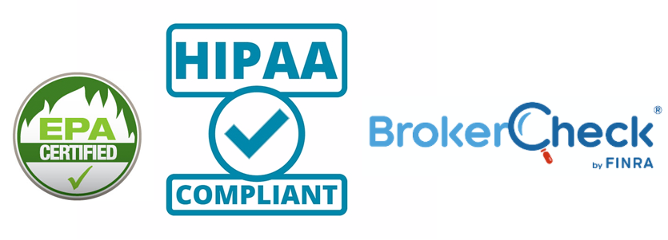

# Regulating the Personal·Information Industry
  

we have seen how powerful companies that use the internet to trade with and profit from our personal·information betray our trust by being negligent with our personal·information, using it for questionable motives, and even engaging in criminal acts  
· this is possible because the personal·information industry is unregulated  

when unregulated industries are found to be dishonest, dangerous, or criminal, the US government has turned to regulation and laws to protect its citizens from bad actors  
· when people were taken advantage of and deceived by unscrupulous investment firms, banks, and brokers, the **Securities and Exchange Commission** was born  
· when the environment was damaged and people got sick or died because of the practices of the pesticide industry, the **Environmental Protection Agency** was born  

now that people’s privacy, the security of their personal·information, and even their personal safety are at risk because of the irresponsible, negligent, and criminal acts of powerful companies that trade on personal·information, it is time to regulate the personal·information industry  
· every company, person, and digital·entity that collects, processes, or shares personal·information must be regulated  
· letting the current state of affairs continue is akin to perpetuating crimes against humanity  

effective regulation of personal·information brokers requires an organization authorized to oversee and monitor companies and people who manipulate personal·information  
· this organization, let’s call it **Personal Information Protection Agency,** would draft rules and regulations inspired by laws such as **Health Insurance Portability and Accountability Act** and **California Consumer Privacy Act,** and organizations such as **Financial Industry Regulatory Authority (FINRA)**, and provide a clearinghouse for all personal·information activities that authorized personal·information brokers perform  
· this regulator would also be able to audit transactions as part of its oversight duties  

the rest of this article provides examples of consumer·protection regulation, which are used to justify the creation of the **Personal Information Protection Agency**  
&nbsp;

## REGULATIONS PROTECT THE ENVIRONMENT, INVESTORS, AND PEOPLE’S HEALTH·INFORMATION
we have regulations that protect consumers  
· their enactments are the result of rampant exploitation of people or the environment by unscrupulous entities  
&nbsp;
&nbsp;

### we regulate the healthcare·industry’s use of health·data
the [**Health Insurance Portability and Accountability Act (HIPAA)**](https://www.hhs.gov/hipaa/for-individuals/guidance-materials-for-consumers/index.html) protects medical·information and other health·information    
· the regulation provides for the privacy and security of health·information through two main sublaws, the *Privacy Rule* and the *Security Rule*  

  * the **Privacy Rule** gives individuals rights over their health·information and sets rules and limits on who can look at and receive a person’s health·information; the rule applies to all forms of protected·health·information, whether it be in digital, written, or oral form  

  * the **Security Rule** requires that entities who handle health·information in digital form keep it confidential, correct, and secure  

the regulation calls the entities to which it applies **covered·entities**, which include:  

  * **health·plans:** health·insurance companies, company health plans, and government programs such as **Medicare** and **Medicaid**  
  
  * **healthcare·providers:** entities who perform electronic business transactions such as billing health·insurance companies; these entities include doctors, clinics, hospitals, psychologists, and dentists  

  * **healthcare·clearinghouses:** entities who process nonstandard health information that they receive from other entities and transform it into a standard format, or the other way around  

business associates of covered·entities must also follow HIPAA regulations; these associates include:  

  * entities that help doctors get paid for providing service, including billing companies and claim processors  
  * entities that help administer health plans
  * lawyers, accountants, and information·technology professionals
  * entities that store or destroy medical records

covered·entities must have contracts with their business·associates that ensure that they use and disclose health·information properly and safeguard it adequately  
· business·associates must also have similar contracts with subcontractors

the **Office for Civil Rights** of the **Department of Health and Human Services** is responsible for the administration and and enforcement of the HIPAA Privacy Rule  
· the office provides assistance to covered·entities to comply with the Privacy Rule  
· it also prosecutes covered·entities who fail comply with the law, imposing civil and criminal penalties

HIPAA ensures that all entities that touch protected health·information follow its rules to provide a high·level of compliance  
· these entities must be certified HIPAA·compliant, and this compliance is spread throughout each entity’s organization  
· all persons that touch protected health·information follow procedures that ensure the privacy of that information  
&nbsp;

### California is trying to protect the privacy of its citizens
the **California Consumer Privacy Act (CCPA)** is a bill that was signed into [law](https://leginfo.legislature.ca.gov/faces/billTextClient.xhtml?bill_id=201720180AB375) by governor **Jerry Brown** in response to a ballot·initiative headed by [**Californians for Consumer Privacy**](https://www.caprivacy.org/about)    
· the ballot·initiative would have provided for stronger protections of private·information and harsher punishments to violators of the law  
· the bill was modified by organizations such as the [**Internet Association**](https://internetassociation.org/) and [**TechNet**](http://technet.org/) which represent the interests of profit·dedicated data·brokers like **Facebook, Google, Twitter,** and **Microsoft**    

with the bill enacted by the California Assembly, the big corporations can lobby to modify the law in their favor  
· nevertheless, starting in January, 2020, CCPA gives individuals some say over how their personal·information is obtained, processed, and shared  
· how the measures are implemented, though, is left to the data·brokers themselves  
· there is no infrastructure requirement that guarantees that the companies put the best technology and practices in place to abide by the data·subjects’ instructions and the law’s requirements  

the CCPA provides individuals these main personal·information rights:  

  * the right to know which personal·information an entity has collected, where it was obtained, what it is being used for, and whether it was sold to (shared with) others, and the type of entities those others are (this is thanks to the lobbying of the profit·dedicated companies; the ballot initiative called for people being able to know who were the actual entities with whom their personal·information was shared)  
  * the right to opt·out of data·sharing  
  * the right to have personal·information deleted  
  * the right not to be discriminated against for opting·out of data·sharing  

the law defines **personal·information** as “*information that identifies, relates to, describes, is capable of being associated with, or could reasonably be linked, directly or indirectly, with a particular consumer or household*”  

personal·information includes:  

  * identifiers such as real·name, alias, postal·address, unique·personal·identifier, online·identifier, IP·address, email·address, account·name, social·security·number, drivers·license·number, passport·number, or other similar identifiers  
  * commercial·information, including records of personal property, products or services purchased, obtained, or considered, or other purchasing or consuming histories or tendencies  
  * biometric·information  
  * internet or other electronic·network activity information, including browsing·history, search·history, and information regarding interactions with websites, apps, or ads  
  * geolocation·data  
  * audio, electronic, visual, thermal, olfactory, or similar information  
  * professional or employment·related information   
  * education·information  
  * inferences drawn from collected information to create a profile about a consumer reflecting the consumer’s preferences, predispositions, behavior, attitudes, intelligence, abilities, and aptitudes  

personal·information does not include publicly available information, “*information that is lawfully made available from federal, state, or local government records, if any conditions [are] associated with such information*”

the CCPA provides people actionable means of ensuring the privacy of their personal·information  
· however, the fact that CCPA can be modified to benefit the entities being regulated, and that there is no infrastructure in place that guarantees the privacy of personal·information at rest and in transit, makes it inadequate to address the failures and criminal activities of profit·dedicated internet companies regarding the capture, use, and sharing of your personal·information    
· the law also provides for basic interaction methods between people and the data·brokers, including phone calls and websites
· however, current technology allows for more convenient and efficient interaction methods, such as using smartphone·based technology  

organizations like the Internet Association and TechNet, backed with the vast resources of the powerful companies they represent, seek to ensure that consumer·protection laws remain friendly to their business models and practices, which do not match the needs and rights of consumers  
· the behavior of these profit·dedicated companies makes it obvious that people need an advocate of their interests that is free of any profit or business prerogative  
· an organization tasked to protect the privacy and security of people’s data is a good start  
· but what we truly need to give people real power over their personal·information is a powerful entity dedicated solely to the digital·happiness of people, that entity is **People·Hood**, of which i will talk about in future articles  
&nbsp;

### the financial·industry’s past criminal behavior earned its current, effective regulation
although privacy·laws such as CCPA aim to give people control over their personal·information, they can be viewed as manipulable [**blue·sky·laws**](https://www.investopedia.com/terms/b/blueskylaws.asp), laws that on their face seem effective but are easily subverted by companies invested in the current state of affairs  
· to effectively protect personal·information, we need more than subvertible laws  
· we need drastic infrastructure change and strong policies that make it effectively impossible for unauthorized entities to get access to protected personal·information, or for authorized entities to use personal·information for questionable or criminal purposes  

we have seen that when it comes to personal·information abuse, we need to take preventive·action because actions after the fact do not adequately protect people’s rights  
· people can do very little to protect the personal·information that companies have on them or have lost track of because of negligence, incompetence, or criminal intent  

the [**Environmental Protection Agency (EPA)**](https://www.epa.gov/aboutepa) is the result of pesticide companies’ [abuse](https://en.wikipedia.org/wiki/Silent_Spring) of the environment, and their deceptive practices aimed at covering up their misdeeds  
• the [**Securities and Exchange Commission (SEC)**](https://www.sec.gov/about.shtml) was created to replace weak blue·sky·laws, to provide real protection to investors from bad financial actors, which included brokers and bankers entrusted with the financial lives of those investors    
· the financial institutions could not be trusted to act in the best interests of their own clients, and state laws enacted to protect the public were not effective

we have a similar situation with profit·dedicated internet companies such as **Facebook, Google,** and **Twitter,** whom have abused their access to personal·data, have shared personal·data irresponsibly, and have not protected personal·data effectively  
• EPA’s mission is “*to protect human health and the environment*”  
• SEC’s mission is “*to protect investors; maintain fair, orderly, and efficient markets; and facilitate capital formation. the SEC strives to promote a marked environment that is worthy of the public’s trust.*”  
• we certainly are in dire need of similar dedication to the protection of personal·information, and the promotion of our trust in the companies that deal with our most precious digital asset  

given the high value of personal·information on the internet, we need a way to regulate effectively entities that base their businesses (and profits) on accessing and sharing personal·information, just like we regulated the investment and pesticide industries a few of generations ago  
· the [**Financial Industry Regulatory Authority (FINRA)**](https://www.finra.org/about/what-we-do), an instrument of the SEC, is a good example of a successful **self·regulatory·organization (SRO)** that effectively regulates the companies and people who provide investment services to others  

  >FINRA is not part of the government. We’re a not-for-profit organization authorized by Congress to protect America’s investors by making sure the broker-dealer industry operates fairly and honestly. <https://www.finra.org/about>  

clearly, companies that trade in personal·information need the oversight that an organization dedicated to personal·information privacy and security can provide  
· FINRA provides a good blueprint for such an organization  

FINRA’s stated objectives are:  

* writing and enforcing rules governing the activities of all registered broker-dealer firms and registered brokers in the US
* examining firms for compliance with those rules  
* fostering market transparency  
* educating investors  

further, FINRA performs its objectives by:  

1. deterring misconduct by enforcing the rules  
2. disciplining those who break the rules  
3. detecting and preventing wrongdoing in the US markets  
4. educating and informing investors  
5. resolving securities disputes  

to give people real control over their personal·information at the legislative level, we need a government·agency or self·regulated·organization tasked with writing and enforcing rules that protect our personal·information  
• to ensure ongoing protection and to discover bad actors, the body must be able to monitor the actions companies take on personal·information    
• this body must also be able to discipline entities (companies and individuals) who break the rules  
• finally, this SRO must educate the public about their rights over their personal·information  

powerful internet companies have shown their unwillingness and incapability to develop and implement secure systems that ensure the privacy of the personal·information they use  
· we need an infrastructure on which *all* companies—from [FAANG](https://www.investopedia.com/terms/f/faang-stocks.asp) to early startups—can benefit equally from strong, reliable digital·security technology, and future advances in this area  
· an environment in which one company offers great security and privacy but shares the personal·information under its control with a company with weaker security and privacy controls in untenable  

just like investment companies and banks are not trusted to regulate themselves when it comes to their dealings with investors, companies that trade in personal·information cannot be trusted to ensure the privacy and security of that information    
&nbsp;
&nbsp;

## LET’S PROTECT PERSONAL·INFORMATION, FOR REAL
the three items just described provide examples of the capabilities that strong, effective, and reliable personal·information·industry regulation should have  
· now what we need is the entity capable of overseeing and monitoring the entities that trade in our personal·information  

like EPA, FINRA, and HIPAA, this organization must be created by Congress and given authority over the collection, trading, and processing of personal·information  
· any entity that uses personal·information in its business must be a member of this organization and comply with its rules  
· noncompliance with those rules must result in civil and criminal penalties for the companies and persons responsible  
the organization should operate an electronic clearinghouse for personal·information activity, on which personal·information brokers present all personal·information transactions regarding the data subjects they’re authorized to represent  
· these transactions would not contain personal·information  
· instead, they would contain data and entity *identifiers*, and the type of transaction being performed, such as acquired, shared, processed, and disposed  
· the **identifiers** can be public·keys, hashes, or other types of identifiers that can be used when auditing the transaction, with the authorization of the data subject  
· the authorization of brokers and member companies would not be required to perform the audits  

this clearinghouse of personal·information activity would be the main component the organization would use to perform its oversight and monitoring operations  
· this would be part of the infrastructure that is essential in guaranteeing the privacy and security of personal·information on the internet  
· every other capability the regulatory organization offers, including compliance·verification and transparency·promotion, would be based on the personal·information activity clearinghouse  

