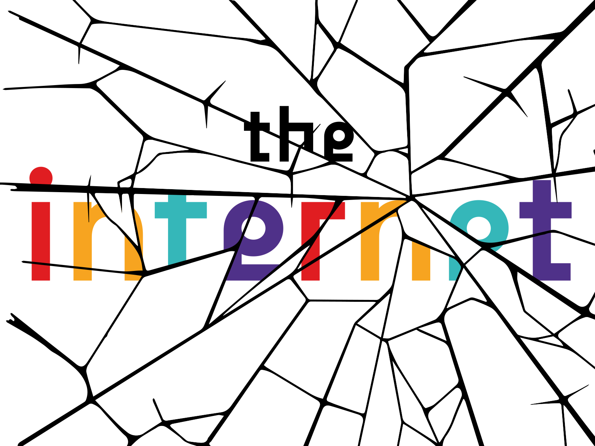
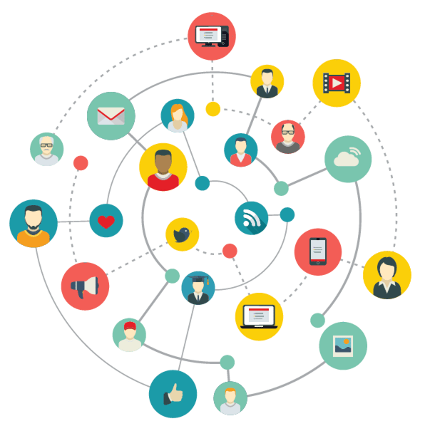
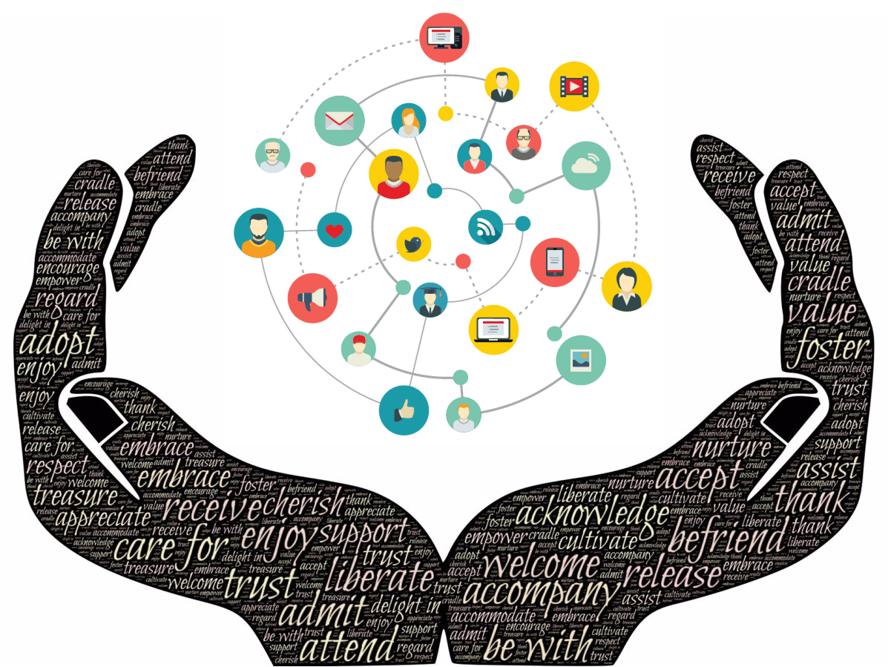
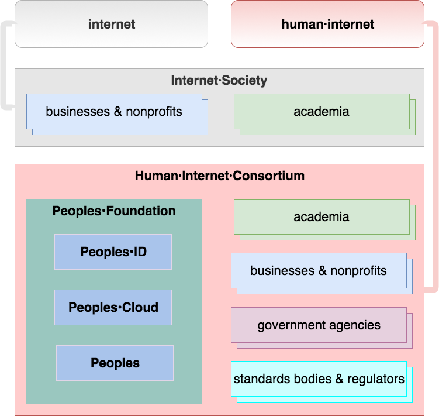
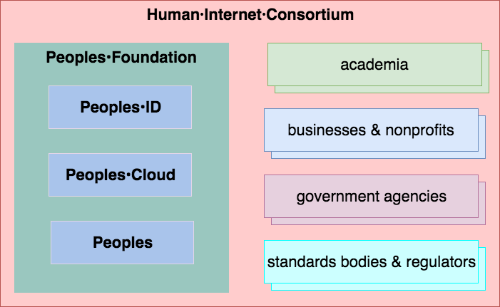
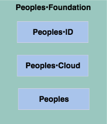

# A Plan for a Private, Safe, and Secure Internet

  

is **Facebook** the model of social·network our society needs?  

  * [Facebook Society—Losing Ourselves in Sharing Ourselves](https://cup.columbia.edu/book/facebook-society/9780231182720)  
  “Facebook claims that it is building a ‘global community.’ Whether this sounds utopian, dystopian, or simply self-promotional, there is no denying that social-media platforms have altered social interaction, political life, and outlooks on the world, even for people who do not regularly use them.”  

  * [Former Facebook exec says social media is ripping apart society](https://www.theverge.com/2017/12/11/16761016/former-facebook-exec-ripping-apart-society)  
  “I think we have created tools that are ripping apart the social fabric of how society works” says **Chamath Palihapitiya,** former vice president of user growth  

  * [Facebook let major tech firms access private messages, friends lists](https://arstechnica.com/tech-policy/2018/12/report-facebook-let-companies-get-even-more-data-than-previously-known)  
  “Pushing for explosive growth, Facebook got more users, lifting its advertising revenue. Partner companies acquired features to make their products more attractive. Facebook users connected with friends across different devices and websites. But Facebook also assumed extraordinary power over the personal information of its 2.2 billion users—control it has wielded with little transparency or outside oversight.”

  * [Sean Parker interview bashes Facebook’s effect on society](https://www.msnbc.com/the-beat-with-ari-melber/watch/sean-parker-interview-bashes-facebook-s-effect-on-society-1092661315818)  

from a human·being’s point of view, Facebook is doing social·media wrong  
&nbsp;

is **Twitter** the thought·sharing and news·sharing platform we want for our kids?  

  * [Why Twitter Is the Best Social Media Platform for Disinformation](https://motherboard.vice.com/en_us/article/bj7vam/why-twitter-is-the-best-social-media-platform-for-disinformation)  
  “The most important thing that we can do is we look at the incentives that we’re building into our product,” [Jack] Dorsey told the Post. “Because they do express a point of view of what we want people to do—and I don’t think they are correct anymore.”
  “Dorsey, along with other Silicon Valley executives like Facebook CEO Mark Zuckerberg, has grappled with how to reconcile his company’s mission and free-speech ethos with the increasingly virulent hate speech and fake news that have infiltrated his platform.”

from a human·being’s point of view, Twitter is doing though·sharing and news·sharing wrong  
&nbsp;

why have Facebook and Twitter gone so wrong?  
· because despite of what they say, they are not guided by society’s enlightenment or the improvement of the human condition  
· Facebook and Twitter are guided solely and totally by [profit·generation](https://www.eff.org/deeplinks/2018/04/facebook-isnt-telling-whole-story-about-its-decision-stop-partnering-data-brokers)  
· at the end of the day, that is how they see themselves, measure themselves, and sell themselves to their owners, as profit·generating machines  

and they are operating *exactly* as designed
  
· as publicly·traded companies, the primary goal of Facebook and Twitter is to guarantee revenue·growth and profit    
· they do that by using personal·information to present ads to people  
· unfortunately, they do not behave honorably when doing so  
· to the contrary, they behave more like vultures when they operate on behalf of their owners  
· sadly, this is what capitalist systems expect from their profit agents  

society needs a different model for people to relate to each other, and for businesses to connect to potential customers, especially on the internet  
· not many years ago, chemical and oil companies were running roughshod with the environment and the health of live creatures, including human beings; society taught them and companies like them a [lesson](https://www.epa.gov/history/origins-epa)  

now companies are exploiting the digital·landscape
 that is the internet  
· they are trampling over the right to privacy, and security of its inhabitants
  
· they are benefiting economically through their abuse of personal·information, behind the backs of the subjects of that information, you, your family, your friends, and your colleagues  

but, just as in years past, society is finding its way toward putting the [breaks](https://ernestbruce.tumblr.com/post/180322418655/achieving-digital-happiness-regulating-the) on these abuses
  
· but we need to do more, soon
  
· we need more than laws and regulations
  
· we need infrastructure that makes it impossible for companies to behave badly, to be irresponsible with the personal·information we put under their care  

we also need new ways of relating with our own data  

· data must be rich with context so that our digital assistants can sift through it and do our bidding reliably and efficiently
  
· we need to be able to store our data in a single place, so that we can give access to it only to people and organizations that we trust  

we need a human·centric internet and everything that goes with it  

&nbsp;

the rest of this document describes the rationale for the **human·internet,** its values, and the many ways it will be implemented for the betterment of society and the elevation of the human condition  
&nbsp;  
&nbsp;  
&nbsp;  

## the internet

**the internet** is a global communications network that connects computing devices around the world, from watches to supercomputers, and everything in between  
· it ensures robust and resilient communication between computing devices

the internet does not have a centralized governance that determines its infrastructure, the rules for access to it, or policies that specify how personal·data is captured, used, shared, sold, and disposed of  
· entities using the internet set their own policies for using the network to meet their requirements and goals  
· such entities include internet service providers, companies, and governments  
· there are entities, such as **Internet Engineering Task Force (IETF)**—a community of individuals and organizations—that promote voluntary standards that specify, for example, the common standards internet·connected devices use to communicate within the network

the internet is not broken, but the entities who use it to make profits do not answer to the needs and wants of its main users: people like you  
· a new network that prioritizes the needs of human beings above the profit motives of big corporations, and that reins in unscrupulous or malevolent actors who abuse it, is needed  
&nbsp;
&nbsp;

### the internet: a very brief history
the internet dates back to a 1960s United States government·backed project whose objective was to build a robust and resilient communications infrastructure using computer networks

the **Advanced Research Projects Agency Network (ARPANET)** project led to the development of protocols for *internetworking* through which multiple networks could be joined into a *network of networks*  
· in 1982, the **internet protocol suite**, known as TCP/IP, was standardized  
· this set of protocols is made of a set of technical standards maintained by IETF  
· after the protocols were standardized, these interconnected networks proliferated throughout the world
&nbsp;
&nbsp;

### the internet: principles for flexibility, robustness, and expandability
the principles of the internet are largely about its function, which is to provide a medium for robust communication between computer networks  
· every user of the internet benefits from these principles  
&nbsp;

the principles of the internet are:  

- **end·to·end principle**  
  · through this principle, the internet enables innovation on top of a reliable, ubiquitous medium  
  · the principle states that the smarts about encoding and decoding data (converting it from a representation that is understandable by humans into a format that can be transmitted digitally, and then back to human·readable form when it arrives at its destination) must be on the endpoint devices (the sending and receiving devices, not the devices in between, tasked only with transporting the encoded data)  
  · this is how technologies that were not in use on the internet when it was conceived, such as videoconferencing, virtual·reality, and telemedicine, can leverage a digital infrastructure that was invented more than 40 years ago  
  · this is similar to the reality that a road system built 50 years ago can serve as the transportation medium for a Tesla Model 3 automobile: the rubber·on·asphalt interaction is the same, regardless of how the car powers the rubber and navigates the road system

- **robustness principle**  
  · this principle states that the software that runs on internet devices must strictly adhere to the rules when it comes to sending information to other devices, but it must be flexible when receiving information from other devices  
  · this means that if a device receives data that is not perfectly formatted but is understandable, the device not only accepts it but also repackages it in a way that strictly adheres to the rules for that type of data before sending it to another device  
  · this practice ensures that a message someone sends reaches its target with minimal corruption, despite the quality of the connections the message used to reach its target  
  · for example, this is how a war correspondent can publish a video report reliably from a place with a bad internet infrastructure, such as a battle field

- **encapsulation principle**  
  · this principle states that details about the communications infrastructure of the internet should be grouped in different abstraction layers (or conceptual areas), depending on the nature of the details  
  · for example, the message “hello, human” is made up of a set of characters  
  · those characters use a specific character encoding, which determines how those characters are translated into bytes, groups of ones and zeros amenable for data transmission  
  · one layer of internet communications, the physical layer, deals with how bytes are moved through wires or through the air, while another layer, the presentation layer, deals with how characters are encoded and decoded  
  · another layer, the transport layer, deals with ensuring that bytes are transmitted reliably  
  · this separation of concerns is how this 40-year old network can carry emojis, which were invented less than 20 years ago, allows you to video chat with a loved one across the globe, and lets millions of people play realistic combat games on their devices  
&nbsp;

  these principles are what makes the internet *the internet*: an *internetworking* infrastructure that enables the movement of bytes from one computing device to another anywhere in the world  
  · the principles, however, are not about people’s rights, how to ensure privacy, or how to identify fake content, apparent shortcomings to the people who trust their digital lives to companies that operate on the network  
  · the principles do not promise identity safety, data privacy, or data security  
  · they do not provide for humane, respectful interactions between entities on the internet  
  
  everything else that comprises digital life on the internet is conceptualized, implemented, and used by entities *on top* of the internet  
  · the standards used to participate on the internet being voluntary means that entities are free to use nonstandard ways to communicate on the internet too  
  · therefore, these entities use the standards that are convenient for them to accomplish their objectives  
  · they can get a few other entities to use those nonstandard techniques to create special groups within the internet, groups that use anonymity to trade in illicit goods and services (entities that break rules or laws), perform financial transactions (banks and investment houses), or carry out secret operations (corporations and government agencies)  
&nbsp;
&nbsp;

### the internet: impact on society
there is no question that the internet has brought society innovative ways of performing activities, making connections, and interacting between and among individuals, communities, and organizations throughout the world  
· because of its extreme focus on providing open, efficient communications facilities, the internet serves as an amoral and efficient information·sharing platform that can be used to provide benefits and services unimaginable before its introduction, or realizable because of its existence  
· its main societal benefit is its capability to connect people, communities, and countries around the world openly, effectively, and resiliently—except, of course, in places where people’s interactions between themselves and with the rest of the world are controlled by authoritarian and oppressive governments

one way to measure the impact of the internet on society is to look at the number of people that use it in their daily lives  
· according to an [Our World in Data](https://ourworldindata.org/about) [report](https://ourworldindata.org/internet), the number of internet users increased from 44 million in 1995 to 3.4 billion in 2016  
· that means that in 1998, eight persons out of 1000 were using the internet, and in 18 years that changed to almost half the world’s population  
· ([1995 population](https://www.wolframalpha.com/input/?i=world+population+1995), [2016 population](https://www.wolframalpha.com/input/?i=world+population+2016))

the internet has dramatically changed the way people learn and collaborate  
· educational material from books to entire courses, including videos, are available online  
· this material includes preschool and postdoctoral content  
· collaborative platforms have made it easy and efficient for people to share knowledge and ideas  
· this allows groups to work efficiently regardless of the physical location of individual members  

people increasingly put their personal and social lives online  
· we use the internet to plan activities, vacations, and our retirements  
· social·networking platforms have introduced new ways to interact and socialize  
· this has made us more independent, more mobile, and more self·sufficient  

but these advances have come at a hefty price  
· the downside of social networking on the internet is the ease with which hate speech and false information can be disseminated  
· individuals who are members of social networks, especially women, have to go through hoops to avoid offensive or even harassing content aimed at them  
· often the platforms on which this content is published do little to help prevent it or to stamp it out because the companies behind those platforms put *their* interests above the interests of the people who use the platforms  
&nbsp;  
&nbsp;  
&nbsp;  

## the human·internet

  

[thinking a better internet](https://youtu.be/E-nIJDHWBkI)  

the problems the internet has brought to society were created outside of it by entities who use the network to further their interests  
· such interests can be good, such as facilitating education in remote locations throughout the world, helping people reconnect with long·lost friends and family, or introduce platforms that drastically change the world of entertainment  
· but it is obvious that some entities use the flexibility and openness of the internet to exploit those innovations for selfish or illicit gain  
· all we have to do to confirm that something is broken is read news about companies not being responsible with the personal·information people entrust to them  
· or discover that companies actively (and creepily) collect all kinds of information about people and use it (or sell it) so that the subjects of such information can be easily targeted with unsolicited, and often undesired, content from anonymous, fake, or untrustworthy entities  

we need to gently nudge entities that live off our personal·data into an internet designed with strong identity verification, data privacy, and data security as its foundation  
· to design this *human* internet, we need an entity driven and motivated by people and their digital identity, digital privacy, and digital security

we need an entity driven by people’s *digital·happiness*, not the enrichment of investors at all costs  
· with *your* help, this is the entity i am dedicated to nurture   
· this entity is not influenced by financial profits because its goal is not to be financially profitable  
· this entity’s goal is to help people free themselves from the limitations of an internet imprisoned by corporate profits, and introduce them to an internet where *they* are the drivers of its activities, where their benefit represents its *profit*  
&nbsp;

what if we could redo the internet with the benefits and interests of *people* at its core?  
· i am developing the nonprofit, people·centric entity that will ensure that people can trust their digital identity, privacy, and security on a *new internet*  
· the name of the nonprofit organization that will introduce the human·internet is **Peoples•Foundation**  

the human·internet is a network with three basic characteristics:  

  * identity  
    · the identity of every entity is attested by a civil authority  
    · you have an identity on the human·internet only because you have an identity in the real world  

  * privacy  
    · all data and content is encrypted  
    · you have complete control over how your data is used, shared, and disposed, by authorizing (or not) each party to access your data  

  * security  
    · data is widely available and never lost  
    · only the parties you authorize can access your information  
    · data breaches are a thing of the past because your data is encrypted  

in the human·internet data and content are respected, protected, and nourished  
· it will always include rich context information to help human and nonhuman entities find it, classify it, and understand it  
&nbsp;

in the human·internet, all entities (individuals, organizations, groups, and communities) can express themselves in a way that reflects their values, interests, sensibilities, and beliefs because the human·internet reflects society, no entity can stifle another entity’s freedom of expression  
· however, entities that publish lies and hate may not have many followers because all entities can choose the entities from whom they get content  
· entities with a reputation of truthfulness, fairness, and empathy will likely have a lot more followers than entities who show themselves as intolerant or having values that go against the majority’s values  
· no one will be able to prevent entities from publishing public content of any kind  
· but each entity will be able to remove particular entities from their source of group, community, and 
public content  
· the internet in which companies like Facebook and Twitter decide what content is allowed and what content is not has given these companies unbelievable power over our lives, often with detrimental effect  
&nbsp;  
&nbsp;  
&nbsp;  

## the Peoples•Foundation mission
in short, the **Peoples•Foundation** mission is to elevate the human condition  
· Peoples•Foundation always puts the interests of human·beings and humanity first  
· every decision, every purchase, every hire will answer, how does this benefit humanity?  
&nbsp;

Peoples•Foundation has these principles:  

  * integrity  
  * loyalty  
  * honor  

Peoples•Foundation follows these premise:  
  * society is faithfully digitally represented when no entity interferes with the social workings of humanity in the digital·world (a single, nonhumanistic entity must not have the power to shape society)  

Peoples•Foundation has these major goals:  

  * educate people about the value and power their personal·information embodies  
  * provide people free, permanent, private, and secure storage of their data and content  
  * give individuals, groups, and communities the ability to become their own platforms  
  * reduce the disproportionate influence of profit·dedicated organizations such as Facebook and Twitter on society  
  * realign the center of gravity of the internet towards the humans that use it and fuel its growth  
  * provide a new and long·lasting environment for personal growth, human advancement, and business interaction  
  * give people a voice about the design and implementation of their platforms  
  * make the ad publication business honorable and trustworthy
  * make the ad consumption experience compelling and rewarding  
  * be the internet that people take to the stars  
  * develop and implement a model of extremely efficient computing  
  * participate in or bootstrap the open development of neuromorphic (neural·network) chips   
  * explore efficient and natural human-machine interaction models  
  * develop a public·cloud infrastructure that uses 100% renewable resources  
  * bring the benefits of a secure, easy·to·use platform, such as the Apple ecosystem, to society at large  
  * provide a place where ideas about the advancement of humanity through data are explored responsibly, slowly, without breaking anything, because personal data is a precious resource for humanity’s growth  
  * earn peoples trust thru solid, reliable, and predictable execution of the foundation’s objectives and operations  
  * investigate the development of a community·backed personal security  
  * reflect humanity’s diversity in its people·force  
  * research and support [transliteracy](https://en.wikipedia.org/wiki/Transliteracy) in content authoring, exploration, navigation, search, and other ways of relating to and experiencing data and content in the digital·world and other mediums  
    
    >transliteracy is concerned with mapping meaning across different media and not with developing particular literacies about various media  
    · it is not about learning text·literacy and visual·literacy and digital·literacy in isolation from one another but about the *interaction* among all these literacies    
    [College & Research Libraries: Introducing transliteracy](https://crln.acrl.org/index.php/crlnews/article/view/8455/8698 "What does it mean to academic libraries?")
    
    >as we think about changing our classrooms, re-envisioning education and what it can be, transliteracy skills are the skills that are needed for students to be successful now and into the future  
    · and when i say transliteracy, i mean the ability to read, to write, to communicate, and to interact across a variety of platforms, both traditional·platforms and digital·platforms    
    [YouTube: Developing Transliteracy](https://youtu.be/BpQrfPQA1Ao "(00:04:30)")
    
    >in this electric age we see ourselves being translated more and more into the form of information, moving towards the technological extension of our consciousness  
    >· the shift form orality to literacy and on to electronic processing engages social, economic, political, religious, and other structures  
    >· the ecology or transliteracy is global, historical, and holistic  
    [Vimeo: Transliteracy lecture by Sue Thomas](https://vimeo.com/2831405 "(00:40:00)")
&nbsp;  
&nbsp;  
&nbsp;  

## the Peoples•Foundation approaches
accomplishing the mission and goals described in the previous section takes a special kind of organization, one that is not beholden to the current way of doing things, which has proven to be flawed and manipulable  
· we must use innovative and humane methods for developing, nurturing, and safeguarding an internet that guarantees that people’s rights over their personal·information are not ignored or trampled over  
· the longevity of such organization must be guaranteed by protecting it from exits, pivots, takeovers, and purchasers motivated by greed  
· growth and revenue targets to appease the needs of investors or shareholders must not enter any discussion about the organization’s present and future  
&nbsp;
&nbsp;

### humanizing influence·networks

humanizing influence·networks means enriching the consumer-brand experience to benefit both consumers and brand·owners (marketers)  
· most people do not like interacting with ads and do not trust the companies that produce ads that waste their time    
· most brand owners leverage questionable practices to reach potential consumers  
· this makes the consumer-brand relationship mostly adversarial, especially during the consumer·acquisition phase  
· *however,* people like to view and interact with compelling content that piques their interest  
· when brand·owners produce content that potential customers want to view and experience, they have a better chance at converting potential consumers into actual consumers  
· facilitating richer and more satisfying consumer-brand experiences makes the human·internet attractive to ad publishers because they are able to offer brand·owners a more receptive audience for their content  
&nbsp;

companies join social·networks to make direct connections with potential customers  
· these personal connections are desirable because through them companies can gain valuable **word·of·mouth**  
· through these connections, also known as **influence·networks,** companies may be able to quickly change public opinion about products, ideology, and communities  
· on top of that, the host platform (Facebook, Twitter) obtains detailed information about its members, which it uses to classify people into advertising targets  
· the ability to target people using myriad categorizations enable these platforms to attract brand·owners, which is how the platforms generate revenue and profits  

  >**the fact that social·networking companies use our natural tendency to make and nurture relationships to target us in profit·producing ad campaigns, and that we benefit very little from those profits—and are often harmed by the consequences of such practices—should give us pause**  

the benefits of the relationships people enter in with profit·dedicated entities should benefit *people* to a larger degree  

brand·owners should also consider whether allowing another company (the owner of the hosting platform) to have such detailed information about their relationships with customers and advocates is strategically wise, given that the company could use that information to gain leverage over them  
&nbsp;

a public, open, and profit·agnostic platform, such as **Peoples•Cloud,** the data and content storage provider of Peoples•Foundation, helps both people and brand·owners  
· placing our data, content, connections, and relationships under a platform owned and controlled by people for the benefit of people helps us to improve our digital lives and attain digital happiness  
· this also helps the brand·owners that count on these relationships for publicity  

people should see ads published by entities they trust  
· such ad publishers must be responsible for vetting the trustworthiness of the brand·owner  
· in this model, ad publishers function as content producers, who commit to presenting audiences only content from trustworthy entities with whom audiences may not have a relationship  
· an ad would function more like an *introduction* by a trusted party of one entity to another, both of whom the trusted party holds in high regard and considers compatible with each other  
· the recipients of the introduction would then have enough information (including their trust in a shared connection) to take the appropriate action for them, such as purchasing a product, or establishing a connection with a potential consumer   

because on the human·internet the connections between people and brands are direct, brand·owners have deeper and more meaningful relationships with active and potential customers  
· when a person has a deep relationship with a brand, one that is not based solely on affordability, fashion, or convenience, but on compatibility and trust, the person sees that brand as part of eir live, not as an expendable 
commodity    
· people also feel that they can directly influence the brand, and may recommend it to their friends or audiences based on feelings and emotions, not only facts  
· this produces more meaningful consumer-brand relationships and influence·networks, with stronger loyalty and, ultimately, generating more sales  
&nbsp;

Peoples•Cloud makes these business-consumer connections richer, more meaningful, and more valuable, both to businesses and consumers  
&nbsp;
&nbsp;

### enabling human·platformization
many people use **Twitter** to spread their thoughts to their Twitter audience  
· many people use **Facebook** to spread news to their Facebook audience  

why must Twitter or Facebook lie between you and your audience?  
&nbsp;

in **Peoples•Cloud,** *you* are the platform  
· you publish your thoughts directly to your family, friends, groups, communities, public·audience, or any combination of these general sets of relations  
· you don not have to worry about a platform’s business·model or political sensitivities determining whether *your audience* can see the content you produce  
· nobody tells you what to publish and what not to publish  
· *however,* what you publish may reduce the number of entities interested in your content  
· but that decision is up to you and you alone because *you* are the platform  
· in Peoples•Cloud, you have a direct connection to your audience  

Peoples•Cloud provides the infrastructure needed to make connections, create relationships, found groups and communities, and facilitate communication between communities, groups, and individuals  
· this ability to be your own platform is called **human·platformization**  
· Peoples•Cloud offers platformization at several levels: individuals, groups, and communities  
· the human·internet, thru Peoples•Cloud, does not rely on profit·dedicated companies to fulfill basic digital human needs of belonging (connection, relationship, and community)  
· we have seen that profit·dedicated entities are not capable of doing that without adding questionable use of personal·information  
&nbsp;

what are people thinking, writing, saying, photographing, or recording?  
· you can know this through the Peoples•Cloud facility that aggregates the public activity of individuals and makes it available to all human·internet denizens  
· people can search and explore this treasure·trove of content because the content is **rich·content**, content that has context·information that makes is simple and efficient to classify, collate, and process  
· big corporations can effectively use content with less context·information because they have the computing resources to *compute* context when they need it  
· but Peoples•Cloud data and content always contain as much context·information as possible to make them easier to use by devices with more austere capabilities  
· in addition, data and content are stored in a way that makes it easy for humans to read; that is, the native format of data and content in Peoples•Cloud is text·based  
· you do not need to use a special database or spreadsheet reader to read and understand the raw content that underlies a medical report   
· think of this as a safer, smarter, more convenient, and more humane internet  
&nbsp;

Peoples•Cloud puts human convenience ahead of computational efficiency  
· this is anathema to most computing·based enterprises, who want to extract every inch of performance they can from their infrastructure because by doing so increases their profit·margins  
· the profit·margins of **Peoples•Foundation** are measured in individual convenience, and personal growth  
· in Peoples•Cloud people manage their exposure to fake content, hate speech, and other undesirable information by disconnecting from the sources of such content  
· a person can also choose to report illegal activity to authorities, who, with access to the perpetrator’s attested identity·information, are able to investigate the report and take appropriate action  
· *the human·internet is not a haven for bullying and malfeasance*  
· bad actors have no place in the human·internet, and have the law thrown at them for their misdeeds  
&nbsp;
&nbsp;

### protecting personal·information
new laws and regulations are being introduced that protect and enforce the right of people to control how their personal·information is processed, shared, and disposed  
· companies are having trouble adhering to these laws, however  
· some are either changing their business practices or going out of business  
· others are trying to [lobby-lawmakers](https://ernestbruce.tumblr.com/post/180322418655/achieving-digital-happiness-regulating-the) to weaken or curtail these laws  
· some companies are coming up with solutions that help data·brokers and data·consumers to adapt their computing systems to the new environment  

Peoples•Cloud is the people·centric solution that solves the problem from both sides:  

  * it provides people with infrastructure and effective controls over their personal·information through a reliable and effective identity, authentication, and authorization system  
  * it also gives data·brokers and data·consumers a way to reduce their exposure to personal·information while continuing to execute their business prerogatives  

this solution is the most natural, effective, just, and affordable option for businesses  
&nbsp;
&nbsp;

### providing new human-machine interaction models
the interactive computing devices we use to carry out our business are everywhere: our desks, our laps, our tables, our hands, our wrists  
· but we also operate in several types of situations: sometimes we can use a keyboard and mouse or trackpad, sometimes we can use touch, other times we can use use only our voice  
· our devices and apps should support all those interaction modes—either automatically or manually—to assist us in performing tasks to manage our data, interact with content, and communicate with others  

the interfaces apps present to us should be perfectly adapted to the situation we are in, the objective we want to accomplish, and the information needed to get it done  
· we do this by developing rich data·models and corresponding operation·models that provide our digital·assistants (smart software·components) the information they need to:  

  * intelligently operate on data,  
  * manage the appropriate interfaces for us to interact successfully with our devices,  
  * and to be helpful and not annoy us, or hinder our success  
&nbsp;

software should never ask us to perform tasks it can perform itself  
· instead it should go ahead and perform the tasks needed to fix problems with obvious solutions  
· software should request our attention only when there are problems it cannot solve without human input  
· we should be able to trust software completely to carry out our tasks and objectives correctly, securely, and reliably  
&nbsp;
&nbsp;

### designing digital·organisms
long·lived **digital·organisms** are the future of software and hardware engineering  
· part of **Peoples•Foundation** mission is to ensure that technology always has human benefit as its main goal  

to develop truly innovative, intelligent, and helpful software we must reexamine our software·development assumptions, principles, and practices  

fundamental computing·architectures, like the von [Neumann architecture](https://www.techopedia.com/definition/32480/von-neumann-architecture), are slowly being replaced with more efficient and flexible ones such as [neuromorphic·architectures](https://youtu.be/TetLY4gPDpo)  
· neuromorphic chips are orders of magnitude more efficient than traditional chips  
· they function like our brains do, using spikes of electricity to communicate information, make decisions, and learn  
· new engineering and programming models are being developed to run smart, adaptive software on these architectures  
&nbsp;

expendable software components—database and messaging systems, started and stopped at will, for example—will be replaced by long·lived **digital·organisms** that learn and communicate knowledge as they operate and interact with other organisms, including humans, while performing tasks to carry-out human objectives  
· these organisms will be modeled after biological·organisms, with specialized *digital·organs*  
· we must use solid engineering and biological concepts to construct and nurture these organisms  
· our new perspective on software·development will result in highly·reliable and trustworthy digital·assistants with which we will interact naturally and effortlessly  
&nbsp;

**Peoples•Foundation,** in its drive to improve the human·condition, will steward projects comprising hardware, software, science, and anthropology to develop humanistic digital·organisms that make the human·internet a reliable, safe, and nurturing environment for humans to interact with other humans, and other types of entities  
· digital·organisms represent a new playing field for all human activity  
· **Peoples•Foundation** will be this field’s founder and its earliest adopter, ensuring that humans are its main beneficiary  
&nbsp;
&nbsp;

### open-sourcing  everything
while most profit·dedicated enterprises focus on amassing a treasure trove of patents to protect their revenue sources—and often to stifle competition—**Peoples•Foundation** and its subsidiaries, including Peoples•ID and Peoples•Cloud, has an *open-source everything* ethos  
· all innovations developed as part of the goal of improving the human condition are contributed to society to, well, *improve the human condition*  

open·source-dedicated organizations, such as [**Linux Foundation**] [Linux·Foundation] and [**FreeBSD Foundation**] [FreeBSD·Foundation], have humanistic goals that are largely compatible with the goals of Peoples•Foundation  
· they have steadfastly supported the sharing of technologies and innovations with the open·source community, and are good role models to follow  
&nbsp;  
&nbsp;  
&nbsp;  

## the components of digital·happiness
the previous section lays out the **Peoples•Foundation** conceptual approaches to accomplishing its mission and goals  
· this section deals with the concrete software and hardware components that bring those into reality  
&nbsp;
&nbsp;

### personal·information ownership and control
data and content stored in **Peoples•Cloud** has the highest degree of privacy and security  
· by leveraging the services of Peoples•Cloud, companies that manage personal data on their own infrastructure have a way to determine their data·subjects’ wishes for the use, processing, sharing, and selling of their 
personal·information  
· this makes it simpler for both individuals and companies to manage personal·information  
· people are able to determine, in one place, how their personal·information is being collected, used, shared, 
and sold  
· they do not have to call or email anyone and wait long for a response  
· the responses to their inquiries are immediate  
· companies that use or work on personal·information are able to implement changes to their use of a person’s personal·information when the person changes the parameters of such use  

a central place on which the interactions of people and companies about an individual’s personal·information means that people can easily control the use of their personal·information, and that companies can efficiently focus their efforts for adhering to new consumer·protection laws regarding personal·information   
&nbsp;
&nbsp;

### rich data and content
in Peoples·Cloud, data and content are structured in a way that make them easily understood and processed by 
digital·organisms  
· this structure includes rich context·information that help find, classify, and understand the information needed to perform particular tasks on behalf of humans and other entities  
· while processing such data and content, digital·organisms learn, and obtain experience in the processing of 
tasks  
· this experience will make processing data and content more efficient, both in time and energy consumption, which helps people, humanity, and our environment  
&nbsp;
&nbsp;

### cognitive·computing
**cognitive·computing** is the practice of integrating learning and reasoning approaches to computing·platforms to create systems capable of reasoning and learning by themselves  
· this is a popular field in many sciences, such as computer·science, neuroscience, and biology   

this section describes how **Peoples•Cloud** leverages cognitive·computing to help people realize their goals by completing simple and boring tasks reliably  
&nbsp;

#### artificial·intelligence
**intelligence** is the ability to perceive and understand information, to classify and catalog it as knowledge, and to use it to adapt to new environments and tailor behavior according to the nature of a larger context or environment  
· as humans, we learn to behave one way in certain situations and a different way in situations that may be similar but that have critical differences  
· for example, we behave differently when sitting in a movie theater watching a movie from the way when we are sitting in a stadium experiencing a concert  
· we use the same cultural, social, scientific, and artistic knowledge in both situations but react very differently in each of them  

**artificial·intelligence** is intelligence that inorganic entities such as computers can manifest  
· in computer·science, artificial·intelligence is the study of devices that can perceive their environment and take actions that maximize their chances of achieving certain goals  
· in recent years, there has been considerable advances in artificial·intelligence:  

  * [a brain in a supercomputer](https://www.youtube.com/watch?v=7euvrj0GQ-k)   
  * [AI Codes its Own ‘AI Child’ (AutoML)](https://www.youtube.com/watch?v=YNLC0wJSHxI) 
  * [how AI can save our humanity](https://www.youtube.com/watch?v=ajGgd9Ld-Wc)  

unfortunately, the vast majority of these advances end up benefiting companies who are dedicated principally to making profits  
· research in artificial·intelligence experiences drastic reductions, known as [**AI·winters**] [ai·winter], when profit·dedicated enterprises determine that the field is not producing the benefits to their business interests that they expect  
· therefore, advances in artificial·intelligence occur mostly when profit·dedicated entities can benefit from its advances  
· this is why we see very little artificial·intelligence research on subjects that would help solely individuals and society—not a company’s bottom line—in their daily lives and their humanity  

we also have to consider the possibility that artificial·intelligence is actually an oxymoron, a nonsensical term  
· our brains are complex, biological organs that operate very differently from current computing·architectures  
· although we can simulate how our brains work, we cannot emulate a working brain with current technology  
· when we can create a machine that can experience humanity the way we do (being born, feeling loved or scared, being anxious, knowing *why* it is playing Go or chess, experiencing culture, being emotionally moved by a piece of art), then we will have created artificial·intelligence  
· a very limited [effort] [UofM:spinnaker] in comparison to the capability and efficiency of the human·brain is a small step in the right direction  

what humans need is **practical·digital·intelligence,** a tool that takes advantage of current hardware (central·processing·units, graphics·processing·units, neural·processing·units, vast amounts of memory, ultrafast network connections) to perform tasks largely unattended, using knowledge, experience, and cooperation  
· the goal of practical·digital·intelligence is to help people accomplish their objectives as efficiently and effortlessly as possible  
&nbsp;

#### practical·digital·intelligence
to benefit people from the computational utility and efficiency improvements that cognitive·computing offers, we must take new approaches on its motivation and implementation  
· we must seek practical solutions to problems people encounter in their daily lives, for example, reducing or eliminating the operations a person needs to perform to complete a simple task, such as emailing a digital·document obtained from a scanner  
· software is capable of performing these chores  

these tasks do not require that users have powerful, high·performance computing devices  
· their desktops, tablets, and handsets are adequate  
&nbsp;

just like profit·dedicated enterprises have demonstrated that they cannot be trusted with personal·information, we must assume that they cannot be trusted to build, and develop, and nurture artificial·intelligence in a way that benefits humanity  

  >The circuits in the biological state machine are dependent on enzymes called recombinases. These enzymes are activated by various inputs into a cell, such as chemical signals, and act to tweak that cell's DNA. But the tweak that actually occurs depends on the orientation of two DNA sequences known as recognition sites. The important thing is that the effect of changing any two recognition sites (the resulting cellular behavior) depends on how other recognition sites have been altered previously. Hence, memory.  
  [*Scientists Built a Biological Computer Inside a Cell*] [biocomputer]  
&nbsp;

**practical·digital·intelligence** uses pattern-recognition and knowledge to classify data and operations while completing a particular task  
· the classification can then be used to configure neural·networks that decide which operations to perform with data at appropriate levels of its structure  
· this usage of classification and neural·networks makes it possible for the system to explain why it made specific decisions  
· these explanations engender trust in the system by data·owners  
· practical·intelligence allows no “black boxes” that hide critical·information from people  
&nbsp;

**Peoples•Foundation** is dedicated to the advancement of practical·digital·intelligence, regardless of what profit·dedicated entities think about the matter  
&nbsp;

#### free·energy computing
the [**free·energy principle**](https://youtu.be/NIu_dJGyIQI) aims to describe how our brains constantly make decisions by efficiently adapting to changes in our environment, either by changing our expectations (learning) or by changing the environment (acting)  
· there is an entire interdisciplinary body of research exploring the use of the free·energy·principle in intelligent systems  

intelligence is about making predictions and free·energy is a method of measuring and reducing prediction errors  
· free·energy·based software can use the resources at its disposal, such as data and its contexts, its relationships with other data and its history, to make decisions about how to modify or use that data to get a desired result  
· this approach to software development results in intelligent software agents that are more efficient (requiring less time, data, and power) at producing correct results than more general artificial·intelligence approaches such as *deep·learning*  
· in this context, *efficiency* can be translated into being able to perform the operations that tasks require in less time, so that either simple tasks can be completed in less time, or complex tasks can be performed in the same amount of time  
&nbsp;

#### neuromorphic computing
**neuromorphic computing** uses neuron·based processing to enhance computation with learning and evolutionary·change capabilities  
· although most research in this area is based on [specialized hardware] [UofM:spinnaker], there are software·only approaches that can be implemented on 
[current hardware] [thenextplatform:neuromorphic·computing·os]  
· these approaches enable the use of learning and adaptive algorithms upon which digital·organisms can be based  
&nbsp;

we can leverage the neuron·based free·energy approach and neuromorphic·computing to develop a system that enables software to adapt to new situations and evolve as it recognizes patterns in data and performs operations to complete the tasks at hand  
· this software would make the *digital·organisms* that make smart and secure processing of personal·information—to the benefit of the owners of such information—not only feasible but highly efficient  
· we can develop the operating·system and **digital·organism·environments** on which digital·organisms *live*  
· with those components, we can research, implement, troubleshoot, and even use digital·organisms in flexible and low·cost environments, instead of on expensive, experimental hardware  

as time goes on, we can incorporate trouble·free hardware that improves the performance and capabilities of digital·organisms  
· that way, we end up with a highly capable and efficient computing environment that is controlled by people to benefit people without the influence of profit·dedicated entities  
&nbsp;

Peoples•Foundation will leverage neuromorphic·computing to ensure that people and humanity benefit from the significant advancements in cognitive·computing that this field promises  
&nbsp;
&nbsp;

### digital·organisms
**digital·organisms** are a new way or relating with data and operations on data  
· these are not the expendable items that apps and services are  
· these are valuable resources with evolution, knowledge, expertise, and history  
· these are not processes that are spawned and killed on a whim  
· digital·organisms are long·running software entities that exist on **Peoples•Cloud**  
· they represent and do the bidding of entities in the human·internet  
· they interact with entities and with other digital·organisms to help people complete tasks  
&nbsp;

digital·organisms require a reliable and secure execution environment  
· this **digital·organism·environment** is based on open·source infrastructure and practices, but is tailored for the creation, nurture, and longtime hosting of digital·organisms

because of the ability of [**InterPlatetary File System** (IPFS)] [IPFS] to keep the history of every data object, digital·organisms will have the ability to examine the past and use it as a type of *memory*  
· this ability to analyze past operations will give the organisms knowledge and experience to determine how past operations gave rise to the object’s current form, and to decide which operations are needed to adapt the object to a changed environment (learning about the new state or changing it) or to complete the task in progress  
· this is *automated·reasoning*  
&nbsp;

**Peoples•Foundation** will ensure that the transformative power and adaptability of digital·organisms is used at the behest of humanity, not the corporate world    
&nbsp;
&nbsp;

### adaptive digital·experiences
[The incredible inventions of intuitive AI](https://youtu.be/aR5N2Jl8k14)  

in the **human·internet**, *digital·experiences* are tailored to a person’s preferences and particular situations  
· **adaptive·digital·assistants** (the new apps) drive digital·experiences with user·interfaces generated on the fly, adapting to a person’s situation    
· when a person is performing an activity that requires visual and physical focus, such as cooking, sie will be able to complete objectives using eir voice  
· when the person can use touch or a physical keyboard and mouse to carry out objectives, sie will use a simple interface, driven by an adaptive·digital·assistant, to interact with the appropriate digital·organism  
· these assistants will be available in all popular security·focused operating·systems and devices  

instead of helping you design a car—which may be useful only to car manufacturers—with an adaptive·digital·assistant, you and your device may design a block diagram together, either while you drive or while you are sitting at a desk  
· this is the kind of intelligent assistance you get on the the human·internet, with digital·organisms and adaptive digital·assistants  

incredible updates:  
· [3D·printed bridge progress](https://youtu.be/1r_Azsa4nqU)  
· [The Hack Rod](https://youtu.be/TDaZUnoYdvs)  
&nbsp;
&nbsp;

### humanistic content exploration and discovery
the internet facilitates good models for creating and consuming content  
· but it does not offer *great*, humanistic models for devising, writing, exploring, discovering, and experiencing content  
&nbsp;

there has been a great model for writing, exploring, and discovering content on digital devices, even before the web was *the web*  
· but while that model helps people create and consume content in a more humanistic way—the way humans have done for thousands of years—it does not help companies make more money  
· that is its fatal flaw  

  >In paper-based reading and writing, we have evolved a valuable set of traditions to provide context for information. A page of a book has quotations and citations which tell about antecedents, or about the intellectual context which helped shape the author's thoughts. We see marginalia and footnotes adding bits of intriguing information or exploring paths that diverge from the main thrust of the argument. In library books we occasionally see a scribbled note vehemently affirming or disparaging the text. Each one of these connections or associations on the page is a link: linking the writing to some reader's pungent opinion, or to collateral or source material sitting on some other shelf in some other library. But beyond the pages of the books are other comments connected by invisible links: book reviews, catalogues and guides listing our book, and new books with footnotes that list our book as a source. Imagine each of these links connected by a thread to form a physical trace of complex web of context. Hypertext software lets us weave that web.  
  [**Udanax Philosophy and Motivation**] [Udanax]  

**Hyper Text Markup Language** (HTML) together with **Hyper Text Transfer Protocol** (HTTP)—and its secure counterpart, HTTPS—is what the web of today is based on  
· however, the web betrays the vision of the person who coined the term *hypertext*, [**Ted Nelson**](https://en.wikipedia.org/wiki/Ted_Nelson)   

the extremely limited interaction models of the web do not approach the content·engagement experiences Nelson envisioned  
· current computing technology is capable of producing the interesting and informative experiences imagined almost sixty years ago  

why cannot we navigate through parallel documents like Nelson [imagined](https://youtu.be/hMKy52Intac "YouTube: Xanadu Basics") so long ago?  
· why do we mostly jump from pages to entirely different pages?  
· why are we not able to view the original context of a quotation we find in a page, like the link to the Udanax Philosophy and Motivation page, located earlier in this section?  
· we usually have to scan the entire target page of a hyperlink to find the quoted text and its surrounding context  

in a time when we can virtually traverse an island in seconds by flying a plane or teleporting, to get to the famed circle and engage in combat using great·looking and realistically·sounding weapons while building shelters as we move, we still traverse literary content using one·way links and Back buttons  
· all those processor cores, gigahertz, memory, and bandwidth, and *in 2018*, we navigate the web using one·way links and 
Back buttons!  

the time for an immersive, fluid content consumption experience has been with us for a long time  
· but the powers behind the internet have not seen economic value in developing such interfaces for humanistic content, whose main reason for being is to improve human lives  

we are in a winter of humanistic web·content consumption, just like we have gone through 
several [artificial·intelligence·winters] [ai·winter]  
· there is not enough profit in making web·content consumption helpful to people  
· the goals of **Peoples•Foundation** include making such interactions a reality in the *human·web*  
&nbsp;

the **human·web,** powered by [**InterPlanetary·File·System**] [IPFS] and **Peoples•Cloud,** will realize Ted·Nelson’s vision of parallel documents; connections between them thru two·way, visible links; live quotations; and different ways of displaying multimedia content on flat, interactive screens  
&nbsp;
&nbsp;

### profit·dedicated·entities
profit·dedicated entities will want to tap into **Peoples•Cloud** to get access to the rich data and content that people store and manage there  
· these entities *will pay* to get that access because the value of the data is greater than the personal·information they get using other less honorable and increasingly illegal approaches  

the identity, privacy, security, and trust elements the human·internet provides, and the new humanistic ways in which people relate to their data and the content they generate or consume, will give people the confidence they need to manage their personal·information on a single, human·based and human·dedicated public platform  
· this platform will also prove to be an effective solution for profit·dedicated entities to adapt to regulations and laws that increasingly are allowing people to make decisions over how their personal·information is captured, used, shared, sold, and disposed  
&nbsp;
&nbsp;

### hardware of, for, and by the people
to provide a complete and compelling experience based on a single vision, this humanistic·plan includes a hardware component  
· there will be desktops, laptops, tablets, handsets, and watches that contain **humanistic·technology**, technology based on [open·hardware](https://opensource.com/resources/what-open-hardware "Opensource.com: What is open hardware?") that advances the human condition  
· the hardware will be high·quality and low·cost so that every one is able to take part in the human·internet  
· people who buy the *hardware of the people* will experience a complete humanistic digital platform, guided only by the needs and wants of people who manage their data and content on **Peoples•Cloud**  
&nbsp;

why have hardware of, for, and by the people?  
· big and powerful companies, such as **Google** exert too much power over smaller players, even dictating what products they can sell to keep their Android license    
· to truly be independent from profit·dedicated companies, people must control the entire ecosystem, including the complete hardware stack, starting at the processor level  

**Apple,** one of the most successful technology companies and brands in the world, is a prime example of what a multifaceted single vision can produce: a company whose products are widely admired by people  
· the single, simple, aesthetic embodied in its hardware and software, engender trust in the brand  
· after all, products that are so beautiful and easy to use must have the same level of quality and attention to detail inside    
· product durability through sound fabrication practices and the use of quality materials ensure that people can sell their used devices to a receptive audience, and that people who like to be on the leading edge of technology keep buying the latest iterations of their favorite products 

a true, independent, people·centric ecosystem must include a people·driven hardware environment in which every component, from the central·processing·unit, graphics·processing·unit, and memory is developed using open·hardware approaches, such as [**RISC-V**] [risc·v·foundation]  

  >The designers claim that the instruction set is the main interface in a computer, because it lies between the hardware and the software. If a good instruction set was open, available for use by all, it should dramatically reduce the cost of software by permitting far more reuse. It should also increase competition among hardware providers, who can use more resources for design and less for software support.  
  [**Wikipedia: RISK-V**](https://en.wikipedia.org/wiki/RISC-V)

with open·hardware, advances in hardware by one player are shared with everybody to the betterment of humanity, not so a profit·dedicated enterprise can make more money  
· a community approach to designing and manufacturing hardware allows us to provide long·term effective support for hardware, with 10 to 20 years of complete (hardware and software) support being the new normal  
· participating in the open·hardware community lifts all boats, not just the yachts of the 
rich and powerful  

developing hardware under open·hardware principles and practices has these main advantages:  

  * the digital·organisms that manage personal·information on behalf of its owners will run on power·efficient hardware not designed or influenced by profit·dedicated corporations whose hardware manufacturing practices and license agreements may not be compatible with humanistic values and practices  

  * people will have access to affordable, high·quality, and durable hardware, such as desktops, laptops, tablets, handsets, and watches  
&nbsp;

hardware will be part of the **Peoples•Foundation** vision of empowering human beings through technology  
&nbsp;  
&nbsp;  
&nbsp;  

## openness and transparency
**Peoples•Foundation** will operate openly and transparently  
· it will be accessible and open to the public  
· minutes, decisions, and resolutions will be publicly available  
· it will also share long·term strategy and operational details openly  
· to contribute development to humanity, it will share its work with open·source and open·hardware communities  

this is not only because Peoples•Foundation will operate under 501(c)(3) rules, but also because it aims at being an active, open participant in society, with the principal goal of elevating humans and improving the human condition  
&nbsp;  

Peoples•Foundation will serve as the example of a responsible and trustworthy humanistic·enterprise we need so badly today  
&nbsp;  
&nbsp;  
&nbsp;  

## the human·internet structure
  

many types of entities relate to and interact with each other on the **internet**  
· to help all these entities work together, some of them get together to develop protocols and policies everybody can use to easily connect, relate, and communicate with others on the internet  
· however, while they usually advocate for corporations, societies, and countries, they do not focus on the needs of individuals  

the **human·internet,** while focusing mainly of the needs and wants of individuals, will also need a way for entities (people, organizations, government agencies, and regulatory bodies) to get together and develop ways to ensure smooth interactions in the new, people·centric network   
· these entities will have to learn how to take care of peoples’ personal·information in a way that they have never considered  
· therefore, the denizens of the human·internet will need the support of an organization that helps them to adapt their business models, practices, and policies to the consumer·focused network  
&nbsp;
&nbsp;

### internet
  

the **internet**, the open global communications network that connects computing devices around the world, is controlled by no one  
· there is no centralized governance controlling the internet  
· whatever privacy and security measures are imposed on personal·information on the internet are strictly voluntary, and there is very little individuals can do to ensure that their information is actually safe, despite pronunciations of *dedication to data privacy and security* made by the companies entrusted with such information  
· but there are entities who aim to provide guidance for the smooth participation of several entities on this 
network  
· one such entity is *Internet·Society*  
&nbsp;
&nbsp;

### Internet·Society
  

[**Internet·Society**](https://www.internetsociety.org/about-internet-society/) is a nonprofit organization that supports the development of standards for the use of the internet by businesses, nonprofits, and academia  
· its members work together on high·level issues dealing with access to the internet, such as network·neutrality, internet·of·things, routing·security, domain·name·system, human·rights, encryption, identity, privacy, and security  
· its direct participants are companies and educational·institutions  
&nbsp;
&nbsp;

### human·internet
  
the **human·internet** is a network that provides a solid infrastructure where identity, privacy, and security are fundamental characteristics:  

  * the identity of all entities in the network is unique, permanent, and linked to the entity’s *real·life* identity  
  * the privacy of personal·information is enforced by the network’s infrastructure, its policies, and its rules  
  * of singular importance is the fact that information·security is *not* left up to an entity’s storage infrastructure and security policies and approaches  
  · the network’s infrastructure at its most basic level ensures the security of the information stored in it  
&nbsp;
&nbsp;

### Human·Internet·Consortium
  

the **Human·Internet·Consortium** will be a nonprofit organization that deals with issues such as personal identity, privacy, and security at a pragmatic level  
· it will design rules and policies for acquiring, processing, and disposing of the personal·information of people who manage data and content in **Peoples•Cloud** (note that *sharing* is not mentioned here, that is because in Peoples•Cloud, entities do not share personal·information with other entities, not with subsidiaries, parent companies, or partners)  
· the consortium’s direct participants are individuals, businesses, educational·institutions, government agencies, and standards·bodies and regulatory·agencies  
&nbsp;
&nbsp;

### Peoples•Foundation
  

**Peoples•Foundation** is the nonprofit·organization with the responsibility of developing the infrastructure that makes the human·internet a reality  
· it will manage projects like **Peoples•ID**, and **Peoples•Cloud** to provide digital·services to:  
  
  * people who store their personal·information in Peoples•Cloud,  
  * entities who want to access personal·information in the most consumer·rights·regulation-compliant way, and  
  * entities who choose to keep managing personal·information on
    their infrastructures but who want to connect with Peoples•Cloud
    users who are also the subjects of the personal·information they possess
    · this is to determine their data·subjects’ wishes for the acquisition, processing, sharing, selling, 
    and disposal of personal·information  
&nbsp;

**Peoples** is the nonprofit·corporation who develops the common software people use to manage their information  
· **Peoples•Foundation** will be a grantmaker to Peoples  
· it will operate openly and transparently as a member of [**Software in the Public Interest**](https://www.spi-inc.org) or by following its example   
· Peoples will also develop the desktops, laptops, tablets, handsets, and watches as [open·hardware](https://opensource.com/resources/what-open-hardware) to provide an all·encompassing platform with the Peoples•Foundation ethos of being bound only by humans’ and humanity’s benefit in its strategy and operations  

Peoples’ main audience comprises “regular” people, users of Facebook, Twitter, and similar services, with little knowledge about computers, computing, operating·systems, and so on  
· although nerds are welcome, Peoples caters principally to the needs of users who are not interested in the inner workings of their devices  
· they are not interested in making their devices more efficient, or in how to change their user·interface theme; they just want to get things done with little fuss  
· these users do not need or want to know about the guts of their devices, but they want to trust them implicitly to help them get things done reliably, with the minimum level or personal·information exposure required  
· they also want their devices to be able to describe the ways in which they have performed tasks on their behalf  
&nbsp;  

Peoples software and hardware will provide a consistent, trusted, reliable, and secure window to the human·internet  
&nbsp;  
&nbsp;  
&nbsp;  

## Peoples•Foundation alternatives
there are enterprises and projects that have goals and objectives similar to the **Peoples•Foundation** vision for bettering peoples’ and humanity’s digital·lives  
· some of them are listed here to illustrate the different levels at which those initiatives operate compared to the Peoples•Foundation environment, and to explain why Peoples•Foundation offers a better approach to the internet·based problems society has today  
&nbsp;
&nbsp;

### social·networking
[**Vero**](https://www.vero.co/vero-true-story) is a social·network that aims to be truthful  
· it gives users an ad·free experience, and control over who sees their content  

[**Mastodon**](https://en.wikipedia.org/wiki/Mastodon_(software)) is a distributed social·network that is principally a **Twitter** alternative that can be also used as a **Facebook** replacement  

[**micro.blog**](https://micro.blog) is a social·network that specializes in **microblogs,** simple websites where users can place their blog posts  
· people can then share those posts with others  

other social·oriented alternatives to Facebook and Twitter are:  
&nbsp; • [**Ello**](https://ello.co/)  
&nbsp; • [**Digg**](http://digg.com)  
&nbsp; • [**Steemit**](https://steemit.com)  
&nbsp;
&nbsp;

### personal·information storage
[**Betterpath**](https://www.betterpath.com) aims to give people more power over their health·data, and help healthcare providers communicate health·data more efficiently  

[**MesInfos** (**MyData**)](http://mesinfos.fing.org/english) is a project that aims to convince organizations to share the personal·information they have on people with their **Cozy·Cloud** personal·cloud  
· people will then be able to add more content to their personal·cloud and use and share that content as they 
  please    
· the MesInfos goals are very similar to the **Peoples•Cloud** goals  
· however, the Peoples•Cloud mission and goals (under the guidance of Peoples•Foundation) are bigger in scope and on their impact on the digital·lives of individuals and humanity as a whole  
&nbsp;
&nbsp;

### open hardware and software
[**System76**](https://system76.com/about) is a company dedicated to open·software and open·hardware  
· one of its goals is producing a completely *open computer*  
· this company is dedicated to making computing something every individual can do without relying on proprietary hardware and software  
· its work in hardware and software is guided by that single vision, which makes it a good example of a humanistic·enterprise  
&nbsp;
&nbsp;

### why Peoples•Foundation is better for you and humanity
the **Peoples•Foundation** mission is the betterment of humanity by improving the digital lives of individuals  
· the main beneficiaries are individuals
· so before looking at how data·brokers and profit·dedicated organizations could benefit from having better informed individuals, and individuals who can exercise more power over their personal·information, the *benefit to the individual* is what the foundation seeks first  
· benefits to other entities are a secondary concern  
· this is how we can ensure continuity in Peoples•Foundations decisions and ongoing practices  
· there will never be conflicts of interest in the work that Peoples•Foundation does because its loyalty is singular: improving the lives of individuals through open technology, education, and empowerment  

the foundation will also ensure that there is real diversity in its people·force  
· we cannot help humanity if we do not *reflect* humanity in all its beliefs, colors, cultures, gender·identities, and music tastes (go EDM!)  
&nbsp;  
&nbsp;  
&nbsp;  

## Peoples•Foundation road·map
Peoples•Foundation aims to be a beacon of humanism in society, technology, and consumer rights  
· its mission is to enrich, protect, and secure the digital·lives of every individual through technological advancements that seek to facilitate the digital·happiness of individuals, groups, communities, and societies  
· to execute its mission Peoples•Foundation will operate as a nonprofit organization with humanity’s improvement through technology as its main goal  
· other goals include the development of technologies, policies, and behaviors that prevent the abuse and murder of women and children from dangerous individuals  
· in addition, enhancing the lives of people through education about the value of social and environmental awareness, the benefits of honest and truthful communication, and the worth of personal·information will always be part of the foundation’s daily activities  
· to ensure its successful build-up and ongoing survival, there are short·term objectives and long·term goals that guide the development of its foundations  

the foundation will rely largely on contributions by individuals and humanistic organizations motivated by the creation of a better future for humanity, a future in which people and their personal·information are treated carefully, respectfully, and securely  
&nbsp;
&nbsp;

### Peoples•Foundation as 501(c)(3) nonprofit·organization
one of the initial objectives of **Peoples•Foundation** is to become a [**505(c)(3)·organization**](https://en.wikipedia.org/wiki/501(c)(3)_organization)  
· under that structure, donations from individuals are tax·exempt  
· the foundation will operate as a charitable, scientific, literary, and educational organization  
· it will also dedicate resources to public·safety  

Peoples•Foundation will loosely model itself after [**Internet Society**] [Internet·Society], [**Linux Foundation**] [Linux·Foundation], and [**FreeBSD Foundation**] [FreeBSD·Foundation], among other notable and humanistic nonprofit·organizations  
· he foundation will dedicate itself to providing practical solutions to today’s personal·information abuses by giving people an effective way to identify themselves and others; a place to store their data and content, privately and securely; and new ways of exploring and discovering shared data and content  
· it will also engage in research to improve human-machine interactions, develop efficient computing solutions, and devise ways of protecting children and women from abuse and violence  
&nbsp;

the purposes of Peoples•Foundation include:  

  * support the human·internet as a private, secure, and safe place
    where people and other entities can connect, relate,
    and interact
    among themselves
  * educate people about their rights and how to exercise them, in particular their rights of self·expression, and power over and control of their personal·information  
  * help people protect themselves against hate and violence
    through
    technology and assistance from individuals, groups, and communities    
  * educate organizations in the use and management of personal·information  
  * help organizations collaborate to make the human·internet safe
    for people to interact among themselves and with organizations
    pursuing business relationships  
&nbsp;
&nbsp;

### short·term objectives
short·term objectives for Peoples•Foundation comprise a period of two years  

#### Peoples•ID
**2019**  

  * develop plan for handset·based **Attestation Authentication and Authorization** (AAA) prototype  
  * develop handset·based prototype  
&nbsp;

**2020**  

* show prototype to identity·attesting government agencies and other interested parties  
* review comments and feedback  
&nbsp;

#### Peoples•Cloud
**2019**  
  
  * design and implement **InterPlanetary File System** (IPFS)–based model for data and content storage  
  * design and implement the **Data and Content  Store** (DCS) digital·service, which manages the **Peoples•Cloud** data·and·content storage·and·retrieval tasks   
&nbsp;

**2020**  
  
  * develop plan for text storage and retrieval  
  * develop laptop·based prototype client  
  * show prototype and vision to universities and interested parties  
  * review comments and feedback  
&nbsp;

#### Peoples
**2020**  

  * develop plan for writing assistant (**Write**) running on macOS, TrueOS, Debian, and Windows   
  * develop platform·specific prototypes  
  * show prototypes and vision to universities and interested parties  
&nbsp;
&nbsp;

### medium·term goals
medium·term goals for Peoples•Foundation comprise a period of five years  
&nbsp;

#### 2020

  * **public education:**  
  
    * educate people on the power they have over big internet·companies
      with their personal·information  
    * educate internet·companies on the business benefits that Peoples•ID
      and Peoples•Cloud offers, especially to early adopters: mindshare

  * **Peoples•Cloud:**  
  
    * publicize working prototypes and plans for the human·internet  
    * develop initial data model to provide rich context to text  
    * integrate rich·text data·model deeply with IPFS capabilities  
&nbsp;

#### 2021

  * **Peoples•ID prototype:**  
  
    * expand to work with government agencies

  * **Peoples•Cloud prototype:**  
  
    * expand to work with hypermedia content and transliterature  
    * expand writing assistant to work with hypermedia content  
    * implement the Entity, Person, Group, and Community digital·organisms  

  * **Peoples:**  
    * develop Peoples•OS for desktops and laptops  
&nbsp;

#### 2022

  * **Peoples•Cloud:**  
  
    * deep integration with IPFS  
    * add visual data·version·exploration and content·version·exploration
      capabilities  

  * **Peoples:**  
  
    * **Write:** expand to work with transliterature  
    * **Explore:** assistant that lets you explore content from Write  
    * **device:** start working on first Peoples device (laptop, tablet, or handset)  
&nbsp;

#### 2023

  * **Peoples**  

    * **Connect:** implement entity·connection assistant
    * **Communicate:** implement communication assistant  
&nbsp;

#### 2025

  * make Peoples•ID officially available to the public, on secure devices  
  * make Peoples•Cloud officially available to the public  
  * make adaptive·digital·assistants officially available to the public  
  * make device available for purchase by the public:  
    * includes 10 years of support  
    * runs Peoples•OS  
&nbsp;
&nbsp;

### funding
this is the funding plan for my work on **Peoples•Foundation** and related projects  
· Peoples•Foundation seeks *people·capital*, not *venture·capital*  
· *people*, not corporations, are the masters of the human·internet  
&nbsp;

#### 2019
initial concepts and prototypes  
· [**Patreon**](https://www.patreon.com/home) [contributions](https://www.patreon.com/ernest_bruce)  
&nbsp;

#### 2020
incorporated business entity  
· donations from individuals or humanistic·organizations  
&nbsp;

#### 2021 and later
registered nonprofit·organization (501(c)(3) tax·exempt)  
· grants and donations from government·agencies, foundations, businesses, trusts, individuals, or humanistic·organizations interested in the development of the human·internet, based on its reliable privacy, and security  
&nbsp;
&nbsp;

### revenue sources (2025 and later)
**Peoples•Cloud**  
proceeds from providing data·consumers and personal·agents access to Peoples•Cloud  

**Peoples**  
sale of devices  
&nbsp;
&nbsp;
&nbsp;

## Peoples•Foundation components
Peoples•Foundation is dedicated to providing reliable identification and authentication services, secure access to personal·information, and technology that takes humanity forward  
· these are the components that make this happen  
&nbsp;
&nbsp;

### Peoples•ID
the Peoples•ID service comprises these capabilities:  

  * government·authority-attested identification  
  * private, semipermanent credentials managed by ondevice secure·elements  
  * private, permanent credentials managed by Peoples•ID  
  * support ondevice biometric·authentication, on request by any entity  
  * support authorization·service  
&nbsp;
&nbsp;

### Peoples•Cloud
the Peoples•Cloud service comprises these capabilities:  

  * uses Peoples•ID to enable an entity to grant another entity access to digital·organism functionalities  
  * **agents** (read and write access to entity data and content) and **consumers** (read access to data and content) interact with digital·organisms to modify entity data and content  
&nbsp;
&nbsp;

### humane data·model
the **data·model** used to store data and content in Peoples•Cloud is context·rich  
· it facilitates intricate interconnection between data and content items to enable seamless and natural navigation, based on context, categorization, and relation  

consumers and agents use data·manipulation interfaces to access and manage all entity data  
&nbsp;
&nbsp;

### Peoples
the Peoples brand represents a people·centric approach to computing, digital·lifestyle, and human services  

#### content authoring
when people create content with the help of assistants, the content is annotated with the creator’s context, including the objective the person is accomplishing, the vocabularies used (for text content), the audiences the content is aimed for, and other pertinent information  
&nbsp;

#### content·experientation
**content·experientation** means how content consumers search, discover, and explore content, including:  
· producing “big pictures” of the content (based on a subject, search·term, or both) so that a person can easily understand the underlying relationships, categorizations, groupings, and context of the content;  
· visualizing the bidirectional links between pieces of content;  
· and traversing those links in convenient ways  
&nbsp;

#### assistant·software
**assistant·software** comprises software components that help people accomplish objectives and tasks  
· this software is reliable and helpful to a level that “apps” using standard development practices are incapable achieving  
· this software runs on macOS, BSD·like, Windows, iOS, Android, and Peoples•OS systems  
· it interacts with Peoples•Cloud digital·organisms  
&nbsp;

#### consumer·hardware
Peoples will develop affordable, high·quality, and durable desktop, laptop, tablet, and handset devices    
· this hardware will be open·source, so that society as whole benefits from the work Peoples does regarding hardware design and construction  
· every piece of hardware will be developed under open·hardware practices and principles, including central·processing·units (CPUs), which will be based on [RISC-V] [risc·v·foundation]  
&nbsp;

#### Peoples•OS operating·system
Peoples•OS will be based on [**TrueOS**](https://www.trueos.org), an operating system that exemplifies the commitment to security and reliability that Peoples is all about  
· it will introduce system·software written in the [**D**](https://dlang.org/) programming·language  
· user·centric software components will be written in the [**Swift**](https://swift.org) programming·language  
· Peoples•OS will be optimized for commercial, [**AMD**](https://www.amd.com/en)·based (Zen 2, Ryzen, Epyc) architectures for the deployment of digital·organisms in Peoples•Cloud  
· to run on Peoples consumer·hardware (laptop, table, handset), Peoples•OS will be optimized for the RISC-V architecture  

[ai·winter]: https://en.wikipedia.org/wiki/AI_winter "Wikipedia: AI Winter"
[Udanax]: http://udanax.xanadu.com/green/febe/philosophy.html "Udanax Philosophy and Motivation"  
[biocomputer]: https://motherboard.vice.com/en_us/article/jpgdgd/engineers-develop-key-building-block-for-sophisticated-bio-computers  
[Linux·Foundation]: https://www.linuxfoundation.org "Linux Foundation"
[FreeBSD·Foundation]: https://www.freebsdfoundation.org "FreeBSD Foundation"
[Internet·Society]: https://www.internetsociety.org "Internet Society"
[UofM:spinnaker]: https://www.manchester.ac.uk/discover/news/human-brain-supercomputer-with-1million-processors-switched-on-for-first-time "University of Manchester: SpiNNaker"
[thenextplatform:neuromorphic·computing·os]: https://www.nextplatform.com/2017/08/02/os-neuromorphic-computing-von-neumann-devices "The Next Platform: neuromorphic·computing OS"
[IPFS]: https://ipfs.io "InterPlanetary File System" 
[risc·v·foundation]: https://riscv.org/risc-v-foundation "RISC-V Foundation"
 

