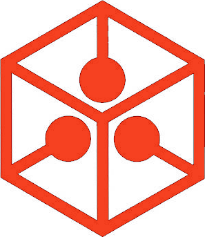

# the human·internet initiative
  
&nbsp;
&nbsp;
&nbsp;

the **human·internet** is the private and secure internet that humanity needs  
&nbsp;

sections:  

* [identity, privacy, and security problems](#identity-privacy-and-security-problems)
* [holistic solution to internet problems](#holistic-solution-to-internet-problems)  
* [helping the initiative](#helping-the-initiative)  

&nbsp;
&nbsp;
&nbsp;

## identity, privacy, and security problems
the internet was designed and implemented to provide fast and reliable communication between computers  
· it, however, was not designed to manage identity, privacy, and security effectively  
· despite this some companies have built successful businesses on the internet  
· but they exhibit shortcomings when it comes to protecting personal·information  
· in particular, they do not provide adequate protection to their computing systems, which facilitates the unauthorized access, modification, capture, or destruction of personal·information by bad actors  

these companies, which include Facebook, Apple, Google, Microsoft, Twitter, and Amazon—some of the most valuable companies in the world—have built large digital·ecosystems on the internet  
· they manage data·privacy in different ways, some more respecting of individual privacy than others  

people do not have effective control over their data on the internet because the data is controlled by the companies that store it  
· each ecosystem has features that people like such as being able to connect with a large number of people or enjoying the smooth operation of integrated apps and services  
· unfortunately, the ecosystems also have drawbacks such as the use of personal·information in intrusive ways or the inability of people to use their information on other platforms in other ecosystems, things that people dislike, ignore, or both  
· people should not have compromise privacy, security, or convenience on the internet  
· these systems should serve human·beings, and should make their lives easier  

the following sections provide a brief description of the Facebook and Apple ecosystems, which represent the major approaches to personal·information storage and usage by large corporations that provide products and services to individuals  
&nbsp;
&nbsp;

### Facebook
the [Facebook ecosystem][Facebook] is composed of apps like Facebook, Messenger, and Instagram   
· the denizens the Facebook ecosystem use one or more these apps  
· Facebook does not charge denizens of its ecosystem for most of the services and apps it provides  
· but it compels them to enter personal·information such as name, birthdate, birthplace, hometown, 
and marital·status  
· this information helps denizens to find and connect with each other, or anybody to find them thru internet searches  
· however, it also provides Facebook the raw materials from which it generates its revenue  

Facebook generates revenue mostly by providing lucrative ad·placement services to advertisers  
· using the data users enter themselves or that it captures in other ways, Facebook displays highly targeted ads to the inhabitants of its ecosystem  
· the company does not have a good record verifying and disclosing the identity of the advertisers it serves  
· it has also shared the personal·information of its denizens with third·parties without their express and informed consent  
· finally, because of inappropriate security measures, bad actors have gained access to the personal·information of millions of users of the Facebook ecosystem  

### Apple
the [Apple ecosystem][Apple] comprises software, apps, and services that provide compelling experiences to its users   
· apps and services like Messages, Calendar, FaceTime, iCloud, and Apple Music work together to provide a seamless, attractive experience to users  
· this is how an Apple denizen who uses iOS and watchOS devices enjoys a largely smooth and flawless experience managing the same data on both platforms  
· a user of iOS and Wear OS devices, on the other hand, does not experience such smooth integration between those platforms  
· for example, the health information captured on a Samsung Galaxy Watch does not appear on the Health app on 
an iPhone   

Apple does not offer services to advertisers using the data of its denizens, as Facebook does  
· it generates revenue by charging users for services, such as Apple Music and iCloud Storage, and 
selling hardware  
&nbsp;
&nbsp;
&nbsp;

## holistic solution to internet problems
large internet companies implement private ecosystems that are largely not interoperable  
· it is either difficult or impossible for a person to share data between ecosystems  

he **human·internet** aims to have the best qualities of environments such as Apple’s and Facebook’s on an open, secure, and human·focused ecosystem on which personal·identity, data·privacy, and data·security are paramount  
· the human·internet is mainly composed of people who have complete control over their personal·information, and entities who access or manage that information with the authorization and on behalf of its owners  
· entities that access or manage personal·information enter into a binding contracts to abide by the rules of *datavault·service* providers and the policies of the human·internet    
· violators of such rules can be suspended or banned from the human·internet  

&nbsp;
&nbsp;
&nbsp;

### human·internet components
the human·internet comprises these types of entities:  

* **data·collection:** set of data and content for an entity (*data·owner*), also known as a data·lake  
* **datavault:** encrypted data·collection that can be accessed only by the data·owner and the entities the data·owner authorizes  
* **data·subject:** entity about whom there exists data that may not be under the control of the entity  
* **data·owner:** entity who controls a datavault hosted by a *datavault·service*   
* **data·owner·agent:** entity whom a data·owner gives total or partial access to the owner’s data (for example, a spouse or a caregiver)  
* **datavault·service:** cloud·based service that provides authenticated·access to datavaults to authorized entities; the provider of such a service may offer other services, such as compute, to process data in specialized ways without the need to transmit data between the client and the service provider  
* **data·consumer:** entity who pays a datavault·service for read·access to data and content in datavaults; the entity must be authorized by data·owners to read their data  
* **data·administrator:** entity who pays a datavault·service for admin·access to data and content in datavaults; the entity must be authorized by data·owners to administer their data  
&nbsp;
&nbsp;
&nbsp;

### human·internet principles
all work and policies of the human·internet are guided by these principles:  

* personal·data and personal·content are precious resources that must be treated with dignity and respect, and protected from harm, abuse, and unauthorized access  

* one data·collection, multiple platforms  
· a data·owner or eir agent can use software on any platform (Peoples·OS, iOS, Android, macOS, Windows, GNU+Linux, Ubuntu Touch, BSD) to access or manage the data·owner’s data·collection  

* data must be encrypted while in·transit or at·rest  
· data is encrypted when stored and before being transmitted between devices  
· even if bad actors breach the security around a datavault·service provider’s computers, they will not be able to access the stored personal·information because it is strongly encrypted  
&nbsp;
&nbsp;
&nbsp;

### datavault service providers
a datavault·service provider is a computing·services provider that stores information about entities, such as human·beings and organizations  
· the provider facilitates access to that information to entities whom the owner of the information authorizes to access it  
· Peoples·Cloud is an example of a human·internet datavault·service provider  
· there are other initiatives, such as MesInfos, that could be datavault·service providers  
&nbsp;
&nbsp;

### the Peoples platform
the **Peoples** platform is guided, owned, and operated by The·People (through the **Peoples·Foundation**) to provide a humane, humanistic, and honorable alternative to Facebook, Google, Amazon, Microsoft, Apple, and other internet behemoths, whose main goal is *not* the overall advancement of individuals, groups, societies, and humanity    
· another of their main goals is to convince people to enter their ecosystems and not to use competing ones  
· while some interaction is possible between the different ecosystems, they are optimized for a person’s complete immersion into the ecosystem  
· from a person’s point of view, their apps and services work most effectively when the person uses only the ones provided by a single corporation  

like the aforementioned corporate entities, the Peoples platform aims to provide hardware, software, education, service, and guidance to its users  
· however, it provides those services to **improve humanity as a whole,** not just the users of a single corporation’s ecosystem  
· instead of profit, the Peoples platform seeks to improve the digital·lives of individuals, and to advance humanity through innovations in technology and human-machine interaction   
· every service provided in Peoples can be used on any platform, providing flexibility and choice to users  
· the platform provides standard ways to interact with data and content (data is always human·readable)

the Peoples open ecosystem is larger in scope than the closed ecosystems of Facebook, Apple, Google, and others  
· instead of private companies owning an ecosystem tailored for their community of users, *The·People* own the Peoples platform, and third·parties *participate* in it based on the good will and reputation they earn through their interactions with people and their data, and how they protect personal·information under their control  

something else differentiates the Peoples ecosystem from other approaches: the fact that it is one system that comprises several components  
· while Facebook is a social·network, messaging·system, and photo·sharing·service, and Twitter is a microblogging service, the Peoples ecosystem will provide all those capabilities (and more) under a single, open, and people·focused guidance  
· there are platforms like [Mastodon][Mastodon] that aim also to provide alternatives to Facebook and Twitter  
· but their drawback is that they focus only on social·networking and microblogging  
· they do not provide datavaults that provide the *single source of truth* for a person’s data and content  
· and they do not provide additional data·collection capabilities such as medicines, dental·work, events, and connections, to name just a few  
· just like people can store their documents in iCloud and work on them using apps on their Mac and iPad devices, people will be able to store data and content on their datavaults and work on that single set of data using several apps, services, and platforms  
· this is the holistic vision and approach to personal·information that is missing from the internet today  

when it comes to presenting ads to people, Peoples will offer similar capabilities to the ones Facebook offers  
· after all, Peoples will have the same kinds of data that Facebook has on its users  
· but the Peoples approach to advertising is more humane  
· instead of just being presented with easy·to·ignore ads, people get *invitations* to connect directly with the advertiser  
· ad responders will be able to initiate a direct connection with that company, something that is more valuable than just an ad impression  

invitations are from entities to whom the user is already connected, entities whose opinion the user trusts  
· these entities can be data·consumers or data·administrators with the additional role of being an *information·source*, entities that provide helpful information and content to the user, which may include connection·invitations    
· when there is a match of interests, for example, the information·source may display content to the user  
· in this case that content is an invitation with an embedded ad  
· the more relevant the invitations the information·source presents to the user, the more the user will trust the source’s judgement    
· but, if the source presents irrelevant content or invitations, the user may choose to remove that capability from the data·consumer or data·administrator  

the advertiser can present content to the user only if the user chooses to connect with the advertiser  
· this puts information·sources in a position of trust both with the user who trusts the source to provide relevant information and introductions, and with the advertiser, who counts on the source to facilitate a good number of connections  

**Peoples·Cloud**, part of the Peoples platform, will offer paid services to entities that need to work with personal·information that Peoples denizens manage in it  
· through Peoples·Cloud these entities will be able to easily adhere to current and upcoming laws, regulations, and policy that specify how personal·information is to be used and disposed of  
· Peoples·Cloud will be a distributed, cloud platform that maintains personal·information private, safe, and secure  
&nbsp;
&nbsp;
&nbsp;

### federated ecosystem
through open standards and collaboration, other platforms, apart from Peoples·Cloud, can provide datavault·services  
· these platforms include the [MesInfos][MesInfos] initiative  
· this initiative has been researching for years the shared use of a person’s data by several parties  
&nbsp;
&nbsp;
&nbsp;

## helping the initiative
to help the **Human·Internet Initiative,** please donate here:  

* [Patreon](https://patreon.com/ernest_bruce)  
* [PayPal](https://paypal.me/ernestbruce) 
&nbsp;

initiative documents:

  * [Laws are Ineffective at Protecting Personal Information][ineffective_laws]  
  * [Regulating the Personal Information Industry][industry_regulation]  
  * [A Plan for a Private, Safe, and Secure Internet][internet_plan]  
  * [Providing Smart·Software to Humanity][smart_software]  
  * Achieving Digital Happiness series:  
  · [Your Identity Needs][identity_needs]  
  · [Your Safety Needs][safety_needs]  
  · [Your Belonging Needs]  
  · [Your Esteem Needs]  
  · [Your Cognition Needs]  
  · [Your Aesthetic Needs]  
  · [Your Actualization Needs]  
  · [Your Transcendence Needs]  
  * [Freeing Humanity from the Shackles of Greed][free_humanity]  

---
2019.02.18:1945-UTC

[ineffective_laws]: https://github.com/ernest-bruce/human-internet/blob/master/ineffective_laws/ineffective_laws.md#laws-are-ineffective-at-protecting-personal-information
[internet_plan]: https://github.com/ernest-bruce/human-internet/blob/master/internet_plan/internet_plan.md
[smart_software]: https://github.com/ernest-bruce/human-internet/blob/master/smart_software/smart_software.md
[identity_needs]: https://github.com/ernest-bruce/human-internet/blob/master/digital_happiness/identity_needs.md#achieving-digital-happiness-your-identity-needs
[safety_needs]: https://github.com/ernest-bruce/human-internet/blob/master/digital_happiness/safety_needs.md#achieving-digital-happiness-your-safety-needs
[industry_regulation]: https://github.com/ernest-bruce/human-internet/blob/master/industry_regulation/industry_regulation.md#regulating-the-personalinformation-industry
[free_humanity]: https://github.com/ernest-bruce/human-internet/blob/master/free_humanity/free_humanity.md#freeing-humanity-from-the-shackles-of-greed

[IPFS]: https://ipfs.io "IPFS.io"
[PeoplesOS]: https://github.com/ernest-bruce/human-internet/blob/master/internet_plan/internet_plan.md#peoplesos-operatingsystem
[MesInfos]: http://mesinfos.fing.org/english
[Facebook]: http://facebook.com/about
[Apple]: http://apple.com/about
[Mastodon]: https://mstdn.io/about